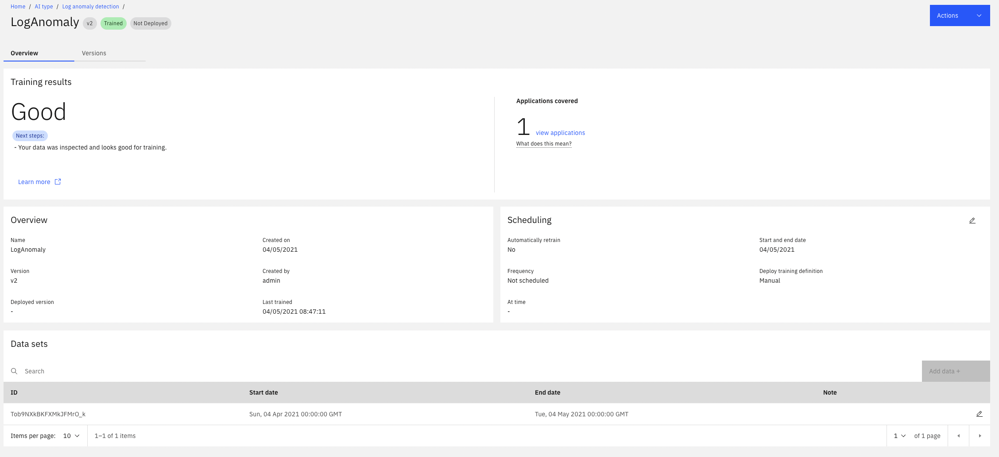
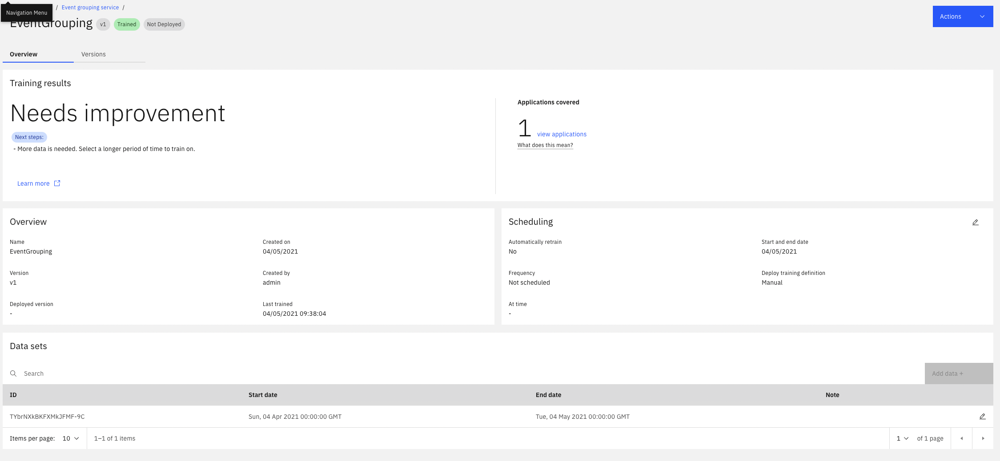

# CP4WatsonAIOps 3.1 Demo Environment Installation


## ❗ THIS IS WORK IN PROGRESS
Please drop me a note on Slack or by mail nikh@ch.ibm.com if you find glitches or problems.
This version is up to date as of April 27th 2021.
The working repo might contain some newer commits and fixes:
[https://github.com/niklaushirt/aiops-install_3.1](https://github.com/niklaushirt/aiops-install_3.1)

# Changes

| Date  | Description  | Files  | 
|---|---|---|
|  22 Apr 2021 | 3.1 Preview install  | This is experimental!  |
|  27 Apr 2021 | Prerequisites  | `jq` and `kubectl` not needed anymore  |
|  28 Apr 2021 | New CatalogSource  | CatalogSource adapted for AIOps Catalog  |
|  29 Apr 2021 | Improved Topology Match  |  |
|  30 Apr 2021 | Demo Events Injection  | New generic method to simulate Events |
|  30 Apr 2021 | Hack for Incident Similarity Demo Training  |  ❗ Not officially supported  |
|  03 Mar 2021 | Removed Bookinfo from Scripts  |  ❗RobotShop is the way forward  |
|  04 Mar 2021 | Added training instructions  |  |
|  07 Mar 2021 | Official beta version  |  |
|  1 Mar 2021 | Added Quote of the Day demo app  | https://gitlab.com/quote-of-the-day/quote-of-the-day by Jim Conallen |
|   |   |   | 


---------------------------------------------------------------------------------------------------------------
# Installation
---------------------------------------------------------------------------------------------------------------

1. [Prerequisites](#prerequisites)
1. [Architecture](#architecture)
1. [AI and Event Manager Base Install](#ai-and-event-manager-base-install)
1. [Configure Humio](#humio)
1. [Connections from AI Manager (Ops Integration)](#connections-from-ai-manager-ops-integration)
2. [Training](#training)
1. [Configure Applications and Topology](#configure-applications-and-topology)
1. [Configure Event Manager](#configure-event-manager)
1. [Configure Runbooks](#configure-runbooks)
1. [Slack integration](#slack-integration)
1. [Some Polishing](#some-polishing)
1. [Check Installation](#check-installation)


> ❗You can find a handy install checklist here: [INSTALLATION CHECKLIST](./README_INSTALLATION_CHECKLIST.md).


---------------------------------------------------------------------------------------------------------------
## Introduction
------------------------------------------------------------------------------

This repository documents the progress of me learning to build a Watson AIOps demo environment.

This is provided `as-is`:

* I'm sure there are errors
* I'm sure it's not complete
* It clearly can be improved

So please if you have any feedback contact me 

- on Slack: Niklaus Hirt or
- by Mail: nikh@ch.ibm.com


---------------------------------------------------------------------------------------------------------------
## Prerequisites
------------------------------------------------------------------------------


### OpenShift requirements

I installed the demo in a ROKS environment.

You'll need:

- ROKS 4.6
- 5x worker nodes Flavor `b3c.16x64` (so 16 CPU / 64 GB)

You might get away with less if you don't install some components (Humio,...)


### Adapt Hosts file (Fyre only)

When using IBM Fyre on Mac you have to adapt your Hosts file.

- Get the IP address of your Cluster 

	```bash
	ping api.<your-fyre-url>
	
		EXAMPLE: 
		ping api.dteocp-270003bu3k-vyvrs.cp.fyre.ibm.com -c1
		
		PING cp-console.apps.dteocp-270003bu3k-vyvrs.cp.fyre.ibm.com (9.30.91.173): 56 data bytes
		64 bytes from 9.30.91.173: icmp_seq=0 ttl=52 time=236.575 ms
	```

- Update Hosts file

	```bash
	vi /etc/hosts
	```
	
- Add the following
	
	```bash	
	<IP from above> cp-console.<your-fyre-url> api.<your-fyre-url>
	
	
		EXAMPLE: 
		9.30.91.173   cp-console.apps.dteocp-270003bu3k-vyvrs.cp.fyre.ibm.com api.dteocp-270003bu3k-vyvrs.cp.fyre.ibm.com
	```


### Storage Requirements

❗**The only officially supported storage solution for production installations is Portworx Enterprise
**
The instructions only apply for demo installations!


Please make sure that an appropriate StorageClass is available (you will have to parametrize those as described in [Adapt configuration](#adapt-configuration))

- On IBM ROKS use: ibmc-file-gold-gid
- On TEC use:      nfs-client
- On FYRE use:     rook-cephfs 

#### ❗Required for installations on IBM Fyre
⚠️ **If you don't have a StorageClass, you can install Rook/Ceph with `./22_install_rook.sh`.**
            

### Docker Pull secret

In order to avoid errors with Docker Registry pull rate limits, you should add your Docker credentials to the Cluster.
This can occur especially with Rook/Ceph installation.

* Go to Secrets in Namespace `openshift-config`
* Open the `pull-secret`Secret
* Select `Actions`/`Edit Secret` 
* Scroll down and click `Add Credentials`
* Enter your Docker credentials

	

* Click Save

If you already have Pods in ImagePullBackoff state then just delete them. They will recreate and should pull the image correctly.
 

### Tooling

You need the following tools installed in order to follow through this guide:

- gnu-sed (on Mac)
- oc
- jq (Not needed anymore)
- kubectl (Not needed anymore - replaced by `oc`)
- kafkacat
- kafka
- helm 3

```bash
/bin/bash -c "$(curl -fsSL https://raw.githubusercontent.com/Homebrew/install/HEAD/install.sh)"
brew install gnu-sed
brew install kafkacat
brew install kafka
# brew install jq
```


Get oc and oc from [here](https://github.com/openshift/okd/releases/)

or use :

```bash
wget https://github.com/openshift/okd/releases/download/4.6.0-0.okd-2021-02-14-205305/openshift-client-mac-4.6.0-0.okd-2021-02-14-205305.tar.gz -O oc.tar.gz
tar xfzv oc.tar.gz
mv oc /usr/local/bin
mv oc /usr/local/bin
```

### Get the scripts and code from GitHub

And obviosuly you'll need to download this repository to use the scripts.


------------------------------------------------------------------------------------------------------------------------------------------------------------------------------------------------------------------------------
## Architecture
------------------------------------------------------------------------------------------------------------------------------------------------------------------------------------------------------------------------------

The environement (Kubernetes, Applications, ...) create logs that are being fed into a Log Management Tool (Humio in this case).


The Log Management Tool (Humio) generates Alerts when it detects a problem and sends them into the Event Manager (Netcool Operations Insight), which in turn sends them to the AI Manager for Event Grouping.

At the same time AI Manager ingests the raw logs coming from the Log Management Tool (Humio) and looks for anomalies in the stream based on the trained model.
If it finds an anomaly it forwards it to the Event Grouping as well.

Out of this, AI Manager creates a Story that is being enriched with Topology (Localization and Blast Radius) and with Similar Incidents that might help correct the problem.

The Story is then sent to Slack.

At the same time Event Manager launches an automated Runbook to correct the problem.


------------------------------------------------------------------------------------------------------------------------------------------------------------------------------------------------------------------------------
## AI and Event Manager Base Install
------------------------------------------------------------------------------------------------------------------------------------------------------------------------------------------------------------------------------

### Adapt configuration

Adapt the 01_config-modules.sh file with the desired parameters:

**Storage Class**

```bash
# WAIOPS Storage Class (ibmc-file-gold-gid, rook-cephfs, nfs-client, ...)
export WAIOPS_STORAGE_CLASS_FILE=ibmc-file-gold-gid
    

# WAIOPS Large Storage Class (ibmc-file-gold-gid, rook-cephfs, nfs-client, ...)
export WAIOPS_STORAGE_CLASS_LARGE_BLOCK=ibmc-file-gold-gid

```

**Optional Components**

```bash
# Install Humio
export INSTALL_HUMIO=true

# Install LDAP Server
export INSTALL_LDAP=true

# Demo Applications
export INSTALL_DEMO=true

```

Make sure that you are logged into your cluster!

### Start installation

```bash
./10_install_aiops.sh -t <PULL_SECRET_TOKEN>
```

This will install:

- Knative
- Strimzi
- CP4WAIOPS


### Post-installation 

The above script will automatically launch the post-installation:

- Humio 
- OpenLDAP
- Demo Apps
- Register LDAP Users
- Gateway
- Housekeeping
	- Additional Routes (Topology, Flink, Strimzi)
	- Create OCP User (serviceaccount demo-admin)
	- Patch Ingress
	- Adapt NGINX Certificates
	- Adapt Slack Welcome message to /welcome


Get the exhaustive list of all the steps [here](./README_INSTALLATION_SCRIPT_STEPS.md).


### Re-running post-installation

In some cases it might be that the post-installation tasks abort for some reason (CRD not ready, Pod not running yet,...).

**It is safe to re-run the post-installation script as many times as needed**:

```bash
./11_postinstall_aiops.sh
```


### Get Passwords and Credentials

At any moment you can run `./80_get_logins.sh` that will print out all the relevant passwords and credentials.

Usually it's a good idea to store this in a file for later use:

```bash
./80_get_logins.sh > my_credentials.txt
```

### Check status of installation

At any moment you can run `./81_check-aiops-install.sh` to check on installation progress.


---------------------------------------------------------------------------------------------------------------
## HUMIO
------------------------------------------------------------------------------

> ❗Humio is being installed by the installation script.


### Configure Humio

* Create Repository `aiops`
* Get Ingest token (<TOKEN_FOR_HUMIO_AIOPS_REPOSITORY>) (`Settings` / `API tokens`)

### Limit retention

This is important as your PVCs will fill up otherwise and Humio can become unavailable.

#### Change retention size for aiops

You have to change the retention options for the aiops repository


#### Change retention size for humio

You have to change the retention options for the humio repository


#### Get the 


### Humio Fluentbit

#### Automatic installation

```bash
./12_install_fluentbit.sh -t <TOKEN_FOR_HUMIO_AIOPS_REPOSITORY>

```


#### Manual installation (optional - old way)

```bash
export INGEST_TOKEN=<MY_TOKEN> (put your token from above)

oc adm policy add-scc-to-user privileged -n humio-logging -z humio-fluentbit-fluentbit-read


helm install humio-fluentbit humio/humio-helm-charts \
  --namespace humio-logging \
  --set humio-fluentbit.token=$INGEST_TOKEN \
  --values ./tools/4_integrations/humio/humio-agent.yaml

oc patch DaemonSet humio-fluentbit-fluentbit -n humio-logging -p '{"spec": {"template": {"spec": {"containers": [{"name": "humio-fluentbit","image": "fluent/fluent-bit:1.4.2","securityContext": {"privileged": true}}]}}}}' --type=merge

oc apply -n humio-logging -f ./tools/4_integrations/humio/FluentbitDaemonSet_CUSTOM.yaml


oc delete -n humio-logging pods -l k8s-app=humio-fluentbit


```


---------------------------------------------------------------------------------------------------------------
## Configure Applications and Topology
------------------------------------------------------------------------------


### Create Kubernetes Observer for the Demo Applications

Do this for RobotShop and QuoteOfTheDay

* In CP4WAIOPS go into `Define` / `Data and tool integrations` / `Advanced` / `Manage ObserverJobs` / `Add a new Job`
* Select `Kubernetes` / `Configure`
* Choose “local”
* Set Unique ID to “<app-namespace>” (robot-shop, qotd...)
* Set Datacenter (I use "demo")
* Set `Correlate` to `true`
* Set Namespace to “<app-namespace>” (robot-shop, qotd ...)
* Set Provider to whatever you like (usually I set it to “listenJob” as well)
* `Save`


### Create REST Observer to Load Topologies

* In CP4WAIOPS go into `Define` / `Data and tool integrations` / `Advanced` / `Manage ObserverJobs` / `Add a new Job`
* Select `REST`/ `Configure`
* Choose “bulk_replace”
* Set Unique ID to “listenJob” (important!)
* Set Provider to whatever you like (usually I set it to “listenJob” as well)
* `Save`


### Create Merge Rules for Kubernetes Observer

Launch the following:

```bash
./tools/5_topology/create-merge-rules.sh
```


### Load Merge Topologies

```bash
./tools/5_topology/create-merge-topology-robotshop.sh
./tools/5_topology/create-merge-topology-qotd.sh

```

This will create Merge Topologies for the two Applications.

Please manually re-run the Kubernetes Observer to make sure that the merge has been done.


### Create AIOps Application

#### Robotshop

* In CP4WAIOPS go into `Operate` / `Application Management` 
* Click `Create Application`
* Select `robot-shop` namespace
* Click `Add to Application`
* Name your Application (RobotShop)
* If you like check `Mark as favorite`
* Click `Save`


#### Quote of the Day

* In CP4WAIOPS go into `Operate` / `Application Management` 
* Click `Create Application`
* Select `qotd` namespace
* Click `Add to Application`
* Name your Application (Quote of the Day)
* If you like check `Mark as favorite`
* Click `Save`


---------------------------------------------------------------------------------------------------------------
## Configure Event Manager
------------------------------------------------------------------------------

### Event Manager Webhooks

Create Webhooks in Event Manager for Event injection and incident simulation for the Demo.

The demo scripts (in the `demo` folder) give you the possibility to simulate an outage without relying on the integrations with other systems.

At this time it simulates:
- Git push event
- Log Events (Humio)
- Security Events (Falco)
- Instana Events


You have to define the following Webhooks in Event Manager (NOI): 


#### Generic Demo Webhook

* `Administration` / `Integration with other Systems`
* `Incoming` / `New Integration`
* `Webhook`
* Name it `Demo Generic`
* Jot down the WebHook URL
* Click on `Optional event attributes`
* Scroll down and click on the + sign for `URL`
* Click `Confirm Selections`


Use this json:

```json
{
  "timestamp": "1619706828000",
  "severity": "Critical",
  "summary": "Test Event",
  "nodename": "productpage-v1",
  "alertgroup": "robotshop",
  "url": "https://pirsoscom.github.io/grafana-robotshop.html"
}
```

Fill out the following fields and save:

* Severity: `severity`
* Summary: `summary & " - " & nodename`
* Resource name: `nodename`
* Event type: `alertgroup`
* Url: `url`
* Description: `"URL"`

Optionnally you can also add `Expiry Time` from `Optional event attributes` and set it to a convenient number of seconds (just make sure that you have time to run the demo before they expire.


### Create custom Filter and View in NOI (optional)

#### Filter

Duplicate `Default` filter and set to global.

* Name: AIOPS
* Logic: Any
* Filter:
	* Manager like 'Inbound Webhook' 
	* Manager = ''

#### View

Duplicate View `Example_IBM_CloudAnalytics` and set to global.


* Name: AIOPS
* 

### Create Templates for Topology Grouping (optional)

This gives you probale cause and is not strictly needed if you don't show Event Manager!

* In the CP4WAIOPS "Hamburger" Menu select `Operate`/`Topology Viewer`
* Then, in the top right corner, click on the icon with the three squares (just right of the cog)
* Select `Create a new Template`
* Select `Dynamic Template`

Create a template for RobotShop:

* Search for `web-deployment` (deployment)
* Create Topology 3 Levels
* Name the template (robotshop)
* Select `Namespace` in `Group type`
* Enter `robotshop_` for `Name prefix`
* Select `Application` 
* Add tag `app:robotshop`
* Save

Create a template for QOTD:

* Search for `qotd-web` (deployment)
* Create Topology 3 Levels
* Name the template (robotshop)
* Select `Namespace` in `Group type`
* Enter `qotd_` for `Name prefix`
* Select `Application` 
* Add tag `app:qotd`
* Save


### Create grouping Policy

* NetCool Web Gui --> `Insights` / `Scope Based Grouping`
* Click `Create Policy`
* On `Alert Group`

#### Create NOI Menu item - Open URL

in the Netcool WebGUI

* Go to `Administration` / `Tool Configuration`
* Click on `LaunchRunbook`
* Copy it (the middle button with the two sheets)
* Name it `Launch URL`
* Replace the Script Command with the following code

	```javascript
	var urlId = '{$selected_rows.URL}';
	
	if (urlId == '') {
	    alert('This event is not linked to an URL');
	} else {
	    var wnd = window.open(urlId, '_blank');
	}
	```
* Save

Then 

* Go to `Administration` / `Menu Configuration`
* Select `alerts`
* Click on `Modify`
* Move Launch URL to the right column
* `Save`

---------------------------------------------------------------------------------------------------------------
## Training
------------------------------------------------------------------------------
### Train Log Anomaly - RobotShop

#### Prerequisites

##### Humio URL

- Get the Humio Base URL from your browser
- Add at the end `/api/v1/repositories/aiops/query`


##### Accounts Token

Get it from Humio --> `Owl` in the top right corner / `Your Account` / `API Token
`
#### Create Humio Integration

* In the CP4WAIOPS "Hamburger" Menu select `Operate`/`Data and tool integrations`
* Under `Humio`, click on `Add Integration`
* Name it `Humio`
* Paste the URL from above (`Humio service URL`)
* Paste the Token from above (`API key`)
* In `Filters (optional)` put the following:

	```yaml
	"kubernetes.namespace_name" = /robot-shop|qotd/
	| "kubernetes.container_name" != load | "kubernetes.container_name" != qotd-load
	```
* Click `Test Connection`
* Leave `Data Flow` in the `**off**` position ❗
* Select `Live data for continuous AI training and anomaly detection`
* Click `Save`


#### Create Kafka Training Integration

* In the CP4WAIOPS "Hamburger" Menu select `Operate`/`Data and tool integrations`
* Under `Kafka`, click on `Add Integration`
* Name it `HumioInject`
* Select `Data Source` / `Logs`
* Select `Mapping Type` / `Humio`
* Paste the following in `Mapping` (the default is **incorrect**!:

	```json
	{
	"codec": "humio",
	"message_field": "@rawstring",
	"log_entity_types": "kubernetes.namespace_name,kubernetes.container_hash,kubernetes.host,kubernetes.container_name,kubernetes.pod_name",
	"instance_id_field": "kubernetes.container_name",
	"rolling_time": 10,
	"timestamp_field": "@timestamp"
	}
	```
	
* Toggle `Data Flow` to the `ON` position
* Select `Data feed for initial AI Training`
* Click `Save`


#### Load Kafka Training Data

First unzip the file ./tools/8_training/2_logs/robotshop-12h.json.zip

```bash
cd ./tools/8_training/2_logs/
unzip ./robotshop-12h.json.zip
cd -
```


Run the script to inject training data:

```bash
./tools/8_training/train-logs-robotshop.sh
```
This should not take more than 15-20 minutes.


If you want to check if the training data has been loaded you can execute:

```bash
oc exec -it $(oc get po |grep aimanager-aio-ai-platform-api-server|awk '{print$1}') -- bash


bash-4.4$ curl -u elastic:$ES_PASSWORD -XGET https://elasticsearch-ibm-elasticsearch-ibm-elasticsearch-srv.aiops.svc.cluster.local:443/_cat/indices  --insecure | grep logtrain | sort
```

You should get something like this (for 20210505 and 20210506):

```bash
  % Total    % Received % Xferd  Average Speed   Time    Time     Time  Current
                                 Dload  Upload   Total   Spent    Left  Speed
100  2716  100  2716    0     0   9769      0 --:--:-- --:--:-- --:--:--  9769
yellow open 1000-1000-20210505-logtrain      06XVqpPTTlCPYlIfZqr-bA 1 1 315652 0  94.2mb  94.2mb
yellow open 1000-1000-20210506-logtrain      slP32RncT-eCEPiUPWrDDg 1 1 385026 0 114.4mb 114.4mb
```


#### Create Training Definition

* In the CP4WAIOPS "Hamburger" Menu select `Operate`/`AI model management`
* Select `Log anomaly detection`
* Select `Create Training Definition`
* Select `Add Data`
* Select `05/05/04` (May 5th - dd/mm/yy) to `07/05/07` (May 7th) as date range (this is when the logs we're going to inject have been created)
* Click `Next`
* Name it "LogAnomaly"
* Click `Next`
* Click `Create`


#### Train the model

* In the training definition click on `Actions` / `Start Training`
* This will start a precheck that should tell you after a while that you are ready for training
* Click on `Actions` / `Start Training` again

After successful training you should get: 



* In the training definition click on `Actions` / `Deploy`


⚠️ If the training shows errors, please make sure that the date range of the training data is set to 21/05/04 to 21/05/07 (this is when the logs we're going to inject have been created)

#### Enable Log Anomaly detection


* In the CP4WAIOPS "Hamburger" Menu select `Operate`/`Data and tool integrations`
* Under `Kafka`, click on `2 integrations`
* Select `HumioInject`
* Scroll down and select `Data feed for continuous AI training and anomaly detection`
* Switch `Data Flow` to `on`
* Click `Save`


### Train Event Grouping


#### Create Integration

* In the CP4WAIOPS "Hamburger" Menu select `Operate`/`Data and tool integrations`
* Under `Kafka`, click on `1 integration`
* Select `noi-default`
* Scroll down and select `Data feed for initial AI Training`
* Toggle `Data Flow` to the `ON` position
* Click `Save`

#### Load Kafka Training Data

First we have to create some Events to train on.

* Adapt the file `./tools/8_training/train-events.sh` by pasting the Webhook URL from above (Generic Demo Webhook).
* Run the Event Generation for 2-3 minutes
	
	```bash
	./tools/8_training/train-events-robotshop.sh.sh
	```

#### Create Training Definition

* In the CP4WAIOPS "Hamburger" Menu select `Operate`/`AI model management`
* Select `Event grouping service`
* Select `Create Training Definition`
* Select `Add Data`
* Select `Last 7 Days` but set the end date to tomorrow
* Click `Next`
* Name it "EventGrouping"
* Click `Next`
* Click `Create`


#### Train the model

* In the training definition click on `Actions` / `Start Training`

After successful training you should get: 



The "Needs improvement" is no concern for the time being.

* In the training definition click on `Actions` / `Deploy`

#### Enable Event Grouping

* In the CP4WAIOPS "Hamburger" Menu select `Operate`/`Data and tool integrations`
* Under `Kafka`, click on `1 integration`
* Select `noi-default`
* Scroll down and select `Data feed for continuous AI training and anomaly detection`
* Switch `Data Flow` to `on`


### Train Incident Similarity


 ❗ Big ugly HACK!
 ⚠️ **This is officially unsupported!**

#### Prerequisite - install old (and unsupported) model-train-console

Run the following and make sure the Pod is running:

```bash
./tools/8_training/install-training-console.sh
```

Wait for the Pod to become available.


#### Incidents Similarity Training


Run the following:

```bash
./tools/8_training/train-incidents-robotshop.sh
```

This will:

1. upload the training files for the application to the training pod
1. output the code that you will have to run in the training pod and 
1. open a shell in the training pod where you can run the commands from step 2.

So just start the script and wait until you get to the prompt.

Then copy the code a bit further up


and paste/execute the code in the pod.


This will train the three similar incident models for the demo applications.

##### To come:
❗ A more official way is in the works, in short:

- Create Dummy SNOW integration (with Live data for initial AI training)
- Create `Training Definition`
- Stream normalized data into Kafka Topic `watsonaiops.incident`

❗ This has not been tested and I just put this here for documentation!


---
### Train Log Anomaly - Quote of the Day

#### Prerequisites

##### Humio URL

- Get the Humio Base URL from your browser
- Add at the end `/api/v1/repositories/aiops/query`


##### Accounts Token

Get it from Humio --> `Owl` in the top right corner / `Your Account` / `API Token
`
#### Create Humio Integration

If you havent' done this for Robotshop (this is only needed once)

* In the CP4WAIOPS "Hamburger" Menu select `Operate`/`Data and tool integrations`
* Under `Humio`, click on `Add Integration`
* Name it `Humio`
* Paste the URL from above (`Humio service URL`)
* Paste the Token from above (`API key`)
* In `Filters (optional)` put the following:

	```yaml
	"kubernetes.namespace_name" = /robot-shop|qotd/
	| "kubernetes.container_name" != load | "kubernetes.container_name" != qotd-load
	```
* Click `Test Connection`
* Leave `Data Flow` in the `**off**` position ❗
* Select `Live data for continuous AI training and anomaly detection`
* Click `Save`


#### Create Kafka Training Integration

If you havent' done this for Robotshop (this is only needed once)

* In the CP4WAIOPS "Hamburger" Menu select `Operate`/`Data and tool integrations`
* Under `Kafka`, click on `Add Integration`
* Name it `HumioInject`
* Select `Data Source` / `Logs`
* Select `Mapping Type` / `Humio`
* Paste the following in `Mapping` (the default is **incorrect**!:

	```json
	{
	"codec": "humio",
	"message_field": "@rawstring",
	"log_entity_types": "kubernetes.namespace_name,kubernetes.container_hash,kubernetes.host,kubernetes.container_name,kubernetes.pod_name",
	"instance_id_field": "kubernetes.container_name",
	"rolling_time": 10,
	"timestamp_field": "@timestamp"
	}
	```
	
* Toggle `Data Flow` to the `ON` position
* Select `Data feed for initial AI Training`
* Click `Save`


#### Load Kafka Training Data

First unzip the file ./tools/8_training/2_logs/QOTD-12h.json.zip

```bash
cd ./tools/8_training/2_logs/
unzip ./QOTD-12h.json.zip
cd -
```


Run the script to inject training data:

```bash
./tools/8_training/train-logs-qotd
```
This should not take more than 15-20 minutes.


If you want to check if the training data has been loaded you can execute:

```bash
oc exec -it $(oc get po |grep aimanager-aio-ai-platform-api-server|awk '{print$1}') -- bash


bash-4.4$ curl -u elastic:$ES_PASSWORD -XGET https://elasticsearch-ibm-elasticsearch-ibm-elasticsearch-srv.aiops.svc.cluster.local:443/_cat/indices  --insecure | grep logtrain | sort
```

You should get something like this (for 20210511):

```bash
  % Total    % Received % Xferd  Average Speed   Time    Time     Time  Current
                                 Dload  Upload   Total   Spent    Left  Speed
100  4264  100  4264    0     0  11462      0 --:--:-- --:--:-- --:--:-- 11431
yellow open 1000-1000-20210511-logtrain         DiGVAYRDRg-tPx7OVoTgLg 1 1      6     0  15.5mb  15.5mb
```


#### Create Training Definition

* In the CP4WAIOPS "Hamburger" Menu select `Operate`/`AI model management`
* Select `Log anomaly detection`
* Select `Create Training Definition`
* Select `Add Data`
* Select `05/05/04` (May 5th - dd/mm/yy) to `12/05/07` (May 12th) as date range (extend this to May 12th, to take into account the logs - created on May 11th)
* Click `Next`
* Name it "LogAnomaly"
* Click `Next`
* Click `Create`


#### Train the model

* In the training definition click on `Actions` / `Start Training`
* This will start a precheck that should tell you after a while that you are ready for training
* Click on `Actions` / `Start Training` again

After successful training you should get: 


* In the training definition click on `Actions` / `Deploy`


⚠️ If the training shows errors, please make sure that the date range of the training data is set to 21/05/04 to 21/05/07 (this is when the logs we're going to inject have been created)

#### Enable Log Anomaly detection


* In the CP4WAIOPS "Hamburger" Menu select `Operate`/`Data and tool integrations`
* Under `Kafka`, click on `2 integrations`
* Select `HumioInject`
* Scroll down and select `Data feed for continuous AI training and anomaly detection`
* Switch `Data Flow` to `on`
* Click `Save`


### Train Event Grouping


#### Create Integration

* In the CP4WAIOPS "Hamburger" Menu select `Operate`/`Data and tool integrations`
* Under `Kafka`, click on `1 integration`
* Select `noi-default`
* Scroll down and select `Data feed for initial AI Training`
* Toggle `Data Flow` to the `ON` position
* Click `Save`

#### Load Kafka Training Data

First we have to create some Events to train on.

* Adapt the file `./tools/8_training/train-events.sh` by pasting the Webhook URL from above (Generic Demo Webhook).
* Run the Event Generation for 2-3 minutes
	
	```bash
	./tools/8_training/train-events-qotd.sh
	```

#### Create Training Definition

* In the CP4WAIOPS "Hamburger" Menu select `Operate`/`AI model management`
* Select `Event grouping service`
* Select `Create Training Definition`
* Select `Add Data`
* Select `Last 7 Days` but set the end date to tomorrow
* Click `Next`
* Name it "EventGrouping"
* Click `Next`
* Click `Create`


#### Train the model

* In the training definition click on `Actions` / `Start Training`

After successful training you should get: 


The "Needs improvement" is no concern for the time being.

* In the training definition click on `Actions` / `Deploy`

#### Enable Event Grouping

* In the CP4WAIOPS "Hamburger" Menu select `Operate`/`Data and tool integrations`
* Under `Kafka`, click on `1 integration`
* Select `noi-default`
* Scroll down and select `Data feed for continuous AI training and anomaly detection`
* Switch `Data Flow` to `on`


### Train Incident Similarity


 ❗ Big ugly HACK!
 ⚠️ **This is officially unsupported!**

#### Prerequisite - install old (and unsupported) model-train-console

Run the following and make sure the Pod is running:

```bash
./tools/8_training/install-training-console.sh
```

Wait for the Pod to become available.


#### Incidents Similarity Training


Run the following:

```bash
./tools/8_training/train-incidents-qotd.sh
```

This will:

1. upload the training files for the application to the training pod
1. output the code that you will have to run in the training pod and 
1. open a shell in the training pod where you can run the commands from step 2.

So just start the script and wait until you get to the prompt.

Then copy the code a bit further up


and paste/execute the code in the pod.


This will train the three similar incident models for the demo applications.

##### To come:
❗ A more official way is in the works, in short:

- Create Dummy SNOW integration (with Live data for initial AI training)
- Create `Training Definition`
- Stream normalized data into Kafka Topic `watsonaiops.incident`

❗ This has not been tested and I just put this here for documentation!


---------------------------------------------------------------------------------------------------------------
## Configure Runbooks
------------------------------------------------------------------------------


### Create Bastion Server

This creates a simple Pod with the needed tools (oc, kubectl) being used as a bastion host for Runbook Automation. 

```bash
oc apply -n default -f ./tools/6_bastion/create-bastion.yaml
```

### Create the NOI Integration

#### In NOI

* Go to  `Administration` / `Integration with other Systems` / `Automation Type` / `Script`
* Copy the SSH KEY


#### Adapt SSL Certificate in Bastion Host Deployment. 

* Select the `bastion-host` Deployment in Namespace `default`
* Adapt Environment Variable SSH_KEY with the key you have copied above.


### Create Automation


#### Connect to Cluster
`Automation` / `Runbooks` / `Automations` / `New Automation`


```bash
oc login --token=$token --server=$ocp_url
```

Use these default values

```yaml
target: bastion-host-service.default.svc
user:   root
$token	 : Token from your login (ACCESS_DETAILS_XXX.md)	
$ocp_url : URL from your login (ACCESS_DETAILS_XXX.md, something like https://c102-e.eu-de.containers.cloud.ibm.com:32236)		
```


#### RobotShop Mitigate Ratings
`Automation` / `Runbooks` / `Automations` / `New Automation`


```bash
oc scale deployment --replicas=1 -n robot-shop ratings
oc delete pod -n robot-shop $(oc get po -n robot-shop|grep catalogue|awk '{print$1}') --force --grace-period=0
```

Use these default values

```yaml
target: bastion-host-service.default.svc
user:   root		
```


### Create Runbooks


* `Library` / `New Runbook`
* Name it `Mitigate RobotShop Problem`
* `Add Automated Step`
* Add `Connect to Cluster`
* Select `Use default value` for all parameters
* Then `RobotShop Mitigate Ratings`
* Select `Use default value` for all parameters
* Click `Publish`


-------
### Add Runbook Triggers

* `Triggers` / `New Trigger`
* Name and Description: `Mitigate RobotShop Problem`
* Conditions
	* Name: RobotShop
	* Attribute: Node
	* Operator: Equals
	* Value: ratings-deployment
* Click `Run Test`
* You should get an Event `[Instana] Robotshop available replicas is less than desired replicas - Check conditions and error events - ratings`
* Select `Mitigate RobotShop Problem`
* Click `Select This Runbook`
* Toggle `Execution` / `Automatic` to `off`
* Click `Save`


---------------------------------------------------------------------------------------------------------------
## Slack integration
------------------------------------------------------------------------------

### ❗NEEDS UPDATING

### Refresh ingress certificates (otherwise Slack will not validate link)

Run the following:

```bash
NAMESPACE=$(oc project -q)
ingress_pod=$(oc get secrets -n openshift-ingress | grep tls | grep -v router-metrics-certs-default | awk '{print $1}')
oc get secret -n openshift-ingress -o 'go-template={{index .data "tls.crt"}}' ${ingress_pod} | base64 -d | base64 -b 0 > cert.crt
oc get secret -n openshift-ingress -o 'go-template={{index .data "tls.key"}}' ${ingress_pod} | base64 -d | base64 -b 0 > cert.key
echo -n "apiVersion: v1
kind: Secret
type: Opaque
metadata:
  name: openshift-tls-secret
  namespace: $NAMESPACE
data:
  cert.crt: " > openshift-tls-secret.yaml
cat cert.crt >> openshift-tls-secret.yaml
echo >> openshift-tls-secret.yaml
echo "  cert.key: " >> openshift-tls-secret.yaml
cat cert.key >> openshift-tls-secret.yaml
oc create -f openshift-tls-secret.yaml

cat openshift-tls-secret.yaml
```
Adapt the `aiops` namespace if you have changed it to something else then run:

```bash
oc patch deployment ibm-nginx -p '{"spec":{"template":{"spec":{"volumes":[{"name":"external-tls-secret","secret":{"secretName": "openshift-tls-secret"}}]}}}}'
rm openshift-tls-secret.yaml
```

Wait for the nginx pods to come up.
```bash
oc get -n aiops pods | grep nginx
```

You must get two `nginx` pods running 1/1.


#### If the integration is not working:


Restart the Slack integration:

```bash
oc delete pod -n aiops $(oc get po -n aiops |grep aio-chatops-slack-integrator|awk '{print$1}')

oc get -n aiops pods | grep aio-chatops-slack-integrator
```


and/or run:

```bash
export WAIOPS_NAMESPACE=aiops
ingress_pod=$(oc get secrets -n openshift-ingress | grep tls | grep -v  router-metrics-certs-default | awk '{print $1}')
oc get secret -n openshift-ingress -o 'go-template={{index .data "tls.crt"}}' ${ingress_pod} |  base64 -d > cert.crt
oc get secret -n openshift-ingress -o 'go-template={{index .data "tls.key"}}' ${ingress_pod} |  base64 -d > cert.key
ibm_nginx_pod=$(oc get -n $WAIOPS_NAMESPACE pods -l component=ibm-nginx -o jsonpath='{.items[0].metadata.name}')
oc -n $WAIOPS_NAMESPACE exec ${ibm_nginx_pod} -- mkdir -p "/user-home/_global_/customer-certs"
oc -n $WAIOPS_NAMESPACE cp cert.crt ${ibm_nginx_pod}:/user-home/_global_/customer-certs/
oc -n $WAIOPS_NAMESPACE cp cert.key ${ibm_nginx_pod}:/user-home/_global_/customer-certs/
for i in `oc -n $WAIOPS_NAMESPACE get pods -l component=ibm-nginx -o jsonpath='{.items[*].metadata.name}' `; do oc -n $WAIOPS_NAMESPACE exec ${i} -- /scripts/reload.sh; done
rm -f cert.crt cert.key
```


### Integration 

More details are [in the official documentation](https://www.ibm.com/docs/en/cloud-paks/cp-waiops/3.1.0?topic=integrations-configuring-slack-integration) 

Or [here](./tree/master/tools/4_integrations/slack) 


Thanks Robert Barron!


### Create User OAUTH Token

This is needed for the reset scripts in order to empty/reset the Slack channels.

This is based on [Slack Cleaner2](https://github.com/sgratzl/slack_cleaner2).

1. Go to [Your Slack App](https://api.slack.com/apps)
1. Select 'OAuth & Permissions' in the sidebar
1. Scroll down to **User Token Scope** and select all scopes you need according to list below
1. Select 'Save changes'
2. Redeploy App if needed


#### User Token scopes
- `channels:read`
- `channels:history`
- `chat:write`
- `files:read`
- `files:write`
- `groups:history`
- `groups:read`
- `im:history`
- `im:read`
- `mpim:history`
- `mpim:read`
- `users:read`


### Change the Slash Welcome Message (optional)

If you want to change the welcome message

```bash
oc set env deployment/$(oc get deploy -l app.kubernetes.io/component=chatops-slack-integrator -o jsonpath='{.items[*].metadata.name }') SLACK_WELCOME_COMMAND_NAME=/aiops-help
```


---------------------------------------------------------------------------------------------------------------
## Some Polishing
------------------------------------------------------------------------------

### Add LDAP Logins to CP4WAIOPS


* Go to CP4AIOps Dashboard
* Click on the top left "Hamburger" menu
* Select `User Management`
* Select `User Groups` Tab
* Click `New User Group`
* Enter demo (or whatever you like)
* Click Next
* Select `LDAP Groups`
* Search for `demo`
* Select `cn=demo,ou=Groups,dc=ibm,dc=com`
* Click Next
* Select Roles (I use Administrator for the demo environment)
* Click Next
* Click Create


### Check if data is flowing


### Get Passwords and Credentials

At any moment you can run `./82_monitor_kafka.sh` this allows you to:

* List all Kafka Topics
* Monitor Derived Stories
* Monitor any specific Topic

You can monitor:

* **derived-stories**: Here you see the stories that get created and pushed to Slack/Teams
* **alerts-noi-1000-1000**: Check if Events from Event Manager are coming in and the Gateway is working as expected (only INSERTS are appearing here, so you might have to delete the Events in Event Manager first in order to recreate them)
* **windowed-logs-1000-1000**: Check log data flowing for log anomaly detection (NOT training)


---

# Check installation

Launch the `./12_check-aiops-install.sh` script to check some elements of the installation

---

# TROUBLESHOOTING

## Pods in Crashloop

If the evtmanager-topology-merge and/or evtmanager-ibm-hdm-analytics-dev-inferenceservice are crashlooping, apply the following patches. I have only seen this happen on ROKS.

```bash
kubectl patch deployment evtmanager-topology-merge -n aiops --patch-file ./yaml/waiops/topology-merge-patch.yaml


kubectl patch deployment evtmanager-ibm-hdm-analytics-dev-inferenceservice -n aiops --patch-file ./yaml/waiops/evtmanager-inferenceservice-patch.yaml
```

---

# Optional Stuff

## Create Humio Live Alerts (Optional)

❗ You'll have to retrain the Event Grouping on those Events


### Create Humio Webhook

* `Administration` / `Integration with other Systems`
* `Incoming` / `New Integration`
* Humio

Name it `Humio` and jot down the WebHook URL.


### Configure Humio Notifier 

**In Humio:**

Go to:

* `aiops` repository
* `Alerts` / `Notifiers` 
* `New Notifier` with the Noi Webhook URL from [above](#humio-webhook) and Skip Cert Validation


### Create Alerts


Click on Alerts -> `+ New Alert`

Create the following Alerts as shown in the picture


❗**IMPORTANT**: Number `2` is especially important because otherwise the messages pushed to NOI get too big and NOI cannot ingest them.


#### RobotRatingsProblem

```yaml
"kubernetes.namespace_name" = "robot-shop"
| "kubernetes.container_name" = ratings
| @rawstring = /Database::getConnection\(\) must be an instance of PDO, null returned/i

Last 5s

resource.name=\"ratings\" severity= Major resource.hostname=ratings-deployment type.eventType=\"robotshop\"

Notification Frequency: 1 min
```


#### RobotShopWebProblem

```yaml
"kubernetes.namespace_name" = "robot-shop"
| "kubernetes.container_name" = ratings
| @rawstring = /ERROR: Database error SQLSTATE/i

Last 5s

resource.name=\"catalogue\" severity=Minor resource.hostname=catalogue-deployment type.eventType=\"robotshop\"

Notification Frequency: 1 min
```

#### RobotShopFrontendProblem

```yaml
"kubernetes.namespace_name" = "robot-shop"
| "kubernetes.container_name" = ratings
| @rawstring = /Connection refused/i

Last 5s

resource.name=\"web\" severity=Minor resource.hostname=web-deployment type.eventType=\"robotshop\"

Notification Frequency: 1 min
```


> You can test by creating a Notifier with https://webhook.site/


### Check Alerts

When you have defined your Alerts and Notifier you can test them by scaling down the pod:

1. Scale down:


	Robotshop
	
	```bash
	oc scale --replicas=0  deployment ratings -n robot-shop
	```


2. Check Alerts:

	You should get some log lines matching the alert filter:
	
	
	
	If not, either you don't receive logs or your filters/alert definitions are wrong.
	
2. Check Notifications:

	You should get "Last triggered: ..." for each Alert:
	
	
	
	If not, your Notifier is incorrectly defined. Check the NOI Webhook URL.

3. Restore apps:

	Don't forget to scale them back up:
	

	
	Robotshop
	
	```bash
	oc scale --replicas=0  deployment catalogue -n robot-shop
	oc delete pod -n robot-shop $(oc get po -n robot-shop|grep catalogue|awk '{print$1}') --force --grace-period=0
	oc delete pod -n robot-shop $(oc get po -n robot-shop|grep user|awk '{print$1}') --force --grace-period=0
	
	```


