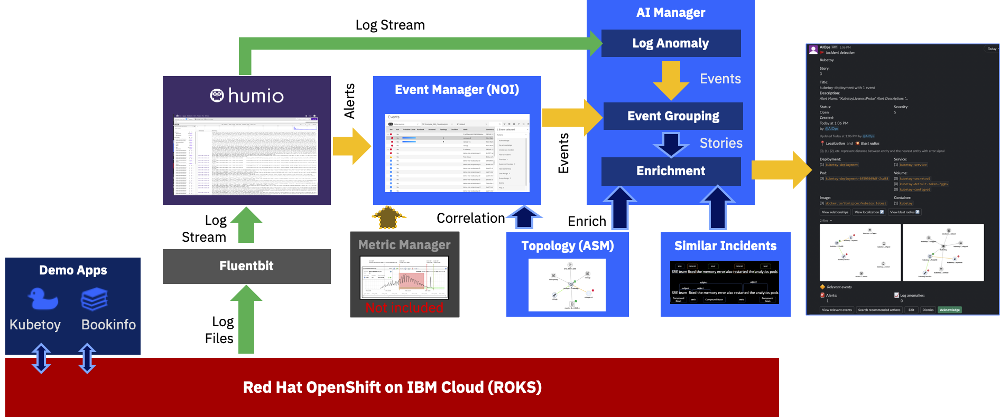
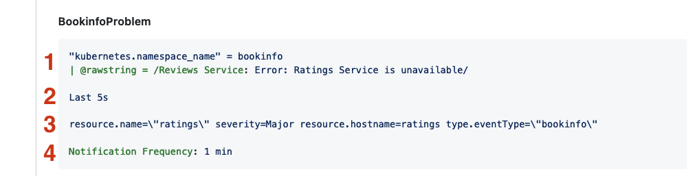
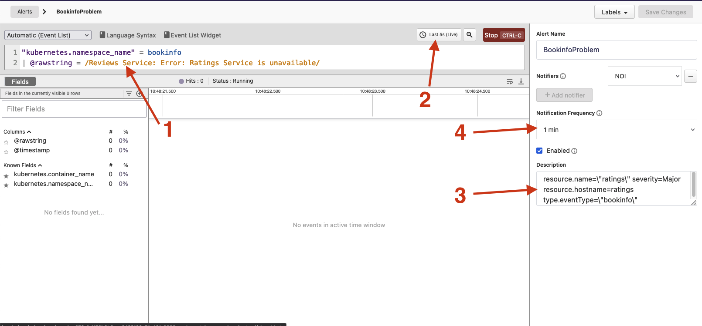
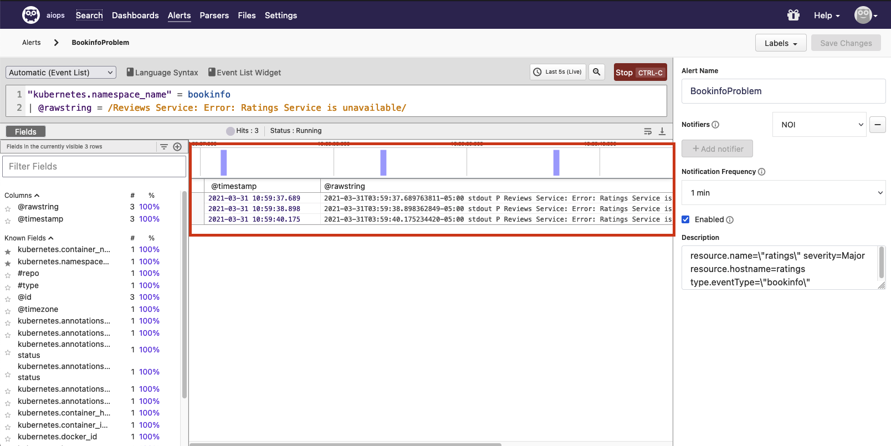
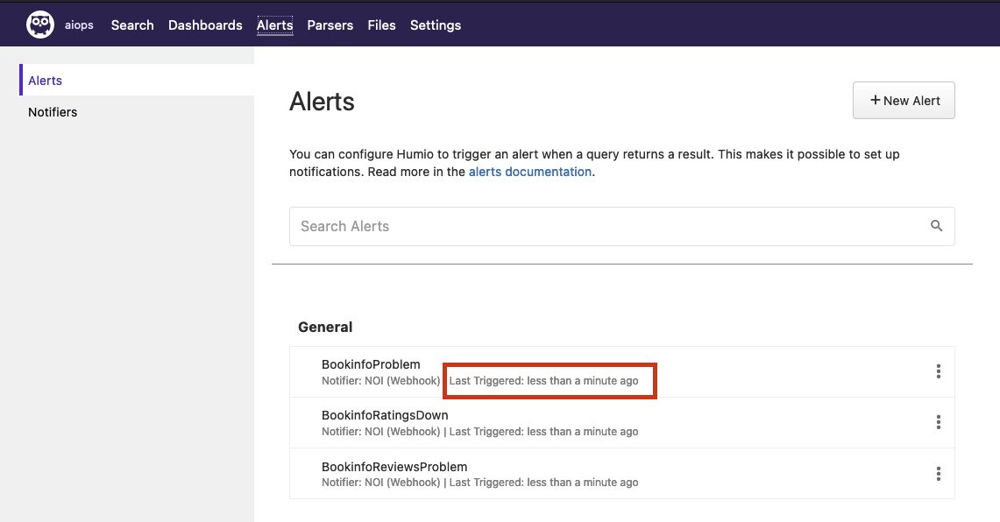
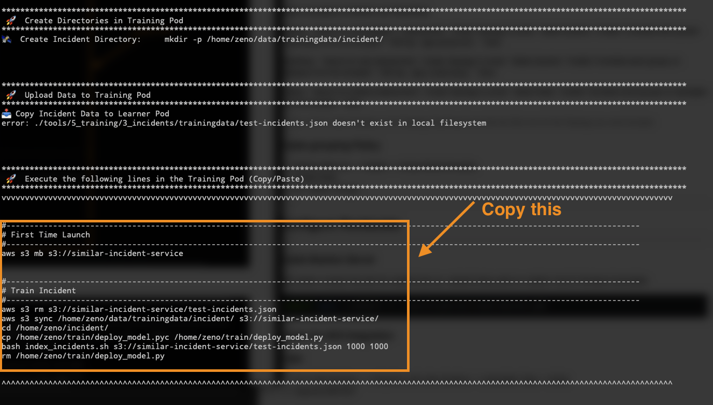
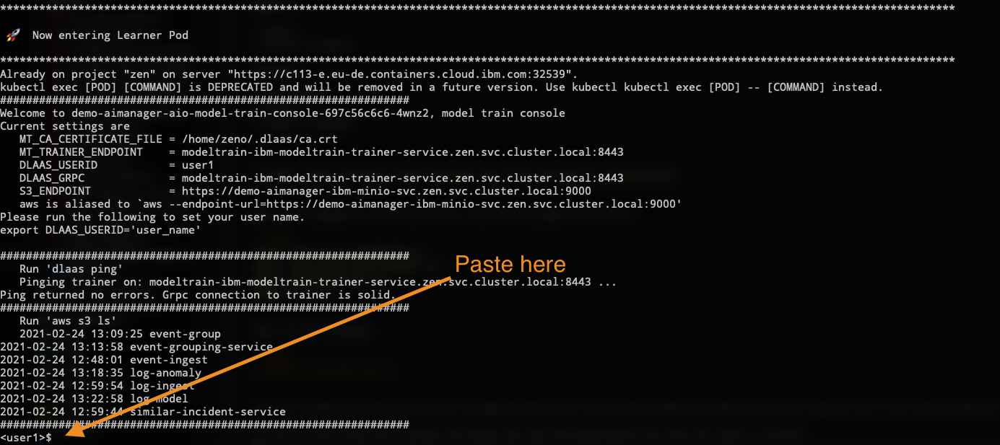

# CP4WatsonAIOps 3.1 Demo Environment Installation


## ❗ THIS IS WORK IN PROGRESS
Please drop me a note on Slack or by mail nikh@ch.ibm.com if you find glitches or problems.
This version is up to date as of April 27th 2021.
The working repo might contain some newer commits and fixes:
[https://github.com/niklaushirt/aiops-install_3.1](https://github.com/niklaushirt/aiops-install_3.1)

# Changes

| Date  | Description  | Files  | 
|---|---|---|
|  22 Apr 2021 | 3.1 Preview install  | This is experimental!  |
|  27 Apr 2021 | Prerequisites  | `jq` and `kubectl` not needed anymore  |
|  28 Apr 2021 | New CatalogSource  | CatalogSource adapted for AIOps Catalog  |
|  29 Apr 2021 | Improved Topology Match  |  |
|  30 Apr 2021 | Demo Events Injection  | New generic method to simulate Events |
|  30 Apr 2021 | Hack for Incident Similarity Demo Training  |  ❗ Not officially supported  |
|   |   |   | 


---------------------------------------------------------------------------------------------------------------
# Installation
---------------------------------------------------------------------------------------------------------------

1. [Prerequisites](#prerequisites)
1. [Architecture](#architecture)
1. [AI and Event Manager Base Install](#ai-and-event-manager-base-install)
1. [Install Humio](#humio)
1. [Train Incident Similarity (HACK)](#train-incident-similarity)
1. [Connections from AI Manager (Ops Integration)](#connections-from-ai-manager-ops-integration)
1. [Configure Event Manager / ASM Topology](#configure-event-manager--asm-topology)
1. [Configure Runbooks](#configure-runbooks)
1. [Slack integration](#slack-integration)
1. [Some Polishing](#some-polishing)
1. [Check Installation](#check-installation)


> ❗You can find a handy install checklist here: [INSTALLATION CHECKLIST](./README_INSTALLATION_CHECKLIST.md).


---------------------------------------------------------------------------------------------------------------
## Introduction
------------------------------------------------------------------------------

This repository documents the progress of me learning to build a Watson AIOps demo environment.

This is provided `as-is`:

* I'm sure there are errors
* I'm sure it's not complete
* It clearly can be improved

So please if you have any feedback contact me 

- on Slack: Niklaus Hirt or
- by Mail: nikh@ch.ibm.com


---------------------------------------------------------------------------------------------------------------
## Prerequisites
------------------------------------------------------------------------------


### OpenShift requirements

I installed the demo in a ROKS environment.

You'll need:

- ROKS 4.6
- 5x worker nodes Flavor `b3c.16x64` (so 16 CPU / 64 GB)

You might get away with less if you don't install some components (Humio,...)


### Adapt Hosts file (Fyre only)

When using IBM Fyre on Mac you have to adapt your Hosts file.

- Get the IP address of your Cluster 

	```bash
	ping api.<your-fyre-url>
	
		EXAMPLE: 
		ping api.dteocp-270003bu3k-vyvrs.cp.fyre.ibm.com -c1
		
		PING cp-console.apps.dteocp-270003bu3k-vyvrs.cp.fyre.ibm.com (9.30.91.173): 56 data bytes
		64 bytes from 9.30.91.173: icmp_seq=0 ttl=52 time=236.575 ms
	```

- Update Hosts file

	```bash
	vi /etc/hosts
	```
	
- Add the following
	
	```bash	
	<IP from above> cp-console.<your-fyre-url> api.<your-fyre-url>
	
	
		EXAMPLE: 
		9.30.91.173   cp-console.apps.dteocp-270003bu3k-vyvrs.cp.fyre.ibm.com api.dteocp-270003bu3k-vyvrs.cp.fyre.ibm.com
	```


### Storage Requirements


Please make sure that an appropriate StorageClass is available (you will have to parametrize those as described in [Adapt configuration](#adapt-configuration))

- On IBM ROKS use: ibmc-file-gold-gid
- On TEC use:      nfs-client
- On FYRE use:     rook-cephfs 

#### ❗Required for installations on IBM Fyre
⚠️ **If you don't have a StorageClass, you can install Rook/Ceph with `./22_install_rook.sh`.**
            

### Docker Pull secret

In order to avoid errors with Docker Registry pull rate limits, you should add your Docker credentials to the Cluster.
This can occur especially with Rook/Ceph installation.

* Go to Secrets in Namespace `openshift-config`
* Select `Actions`/`Edit Secret` 
* Scroll down and click `Add Credentials`
* Enter your Docker credentials

	

* Click Save

If you already have Pods in ImagePullBackoff state then just delete them. They will recreate and should pull the image correctly.
 

### Tooling

You need the following tools installed in order to follow through this guide:

- gnu-sed (on Mac)
- oc
- jq (Not needed anymore)
- kubectl (Not needed anymore - replaced by `oc`)
- kafkacat
- helm 3

```bash
/bin/bash -c "$(curl -fsSL https://raw.githubusercontent.com/Homebrew/install/HEAD/install.sh)"
brew install gnu-sed
brew install kafkacat
# brew install jq
```


Get oc and oc from [here](https://github.com/openshift/okd/releases/)

or use :

```bash
wget https://github.com/openshift/okd/releases/download/4.6.0-0.okd-2021-02-14-205305/openshift-client-mac-4.6.0-0.okd-2021-02-14-205305.tar.gz -O oc.tar.gz
tar xfzv oc.tar.gz
mv oc /usr/local/bin
mv oc /usr/local/bin
```


------------------------------------------------------------------------------------------------------------------------------------------------------------------------------------------------------------------------------
## Architecture
------------------------------------------------------------------------------------------------------------------------------------------------------------------------------------------------------------------------------

The environement (Kubernetes, Applications, ...) create logs that are being fed into a Log Management Tool (Humio in this case).



The Log Management Tool (Humio) generates Alerts when it detects a problem and sends them into the Event Manager (Netcool Operations Insight), which in turn sends them to the AI Manager for Event Grouping.

At the same time AI Manager ingests the raw logs coming from the Log Management Tool (Humio) and looks for anomalies in the stream based on the trained model.
If it finds an anomaly it forwards it to the Event Grouping as well.

Out of this, AI Manager creates a Story that is being enriched with Topology (Localization and Blast Radius) and with Similar Incidents that might help correct the problem.

The Story is then sent to Slack.

At the same time Event Manager launches an automated Runbook to correct the problem (scale up the Bookinfo Ratings deployment).


------------------------------------------------------------------------------------------------------------------------------------------------------------------------------------------------------------------------------
## AI and Event Manager Base Install
------------------------------------------------------------------------------------------------------------------------------------------------------------------------------------------------------------------------------

### Adapt configuration

Adapt the 01_config-modules.sh file with the desired parameters:

**Storage Class**

```bash
# WAIOPS Storage Class (ibmc-file-gold-gid, rook-cephfs, nfs-client, ...)
export WAIOPS_STORAGE_CLASS_FILE=ibmc-file-gold-gid
    

# WAIOPS Large Storage Class (ibmc-file-gold-gid, rook-cephfs, nfs-client, ...)
export WAIOPS_STORAGE_CLASS_LARGE_BLOCK=ibmc-file-gold-gid

```

**Optional Components**

```bash
# Install Humio
export INSTALL_HUMIO=true

# Install LDAP Server
export INSTALL_LDAP=true

# Demo Applications
export INSTALL_DEMO=true

```

Make sure that you are logged into your cluster!

### Start installation

```bash
./10_install_aiops.sh -t <PULL_SECRET_TOKEN>
```

This will install:

- Knative
- Strimzi
- CP4WAIOPS
- Humio 
- OpenLDAP

And automatically launch the post-installation:

- Demo Apps
- Register LDAP Users
- Gateway
- Housekeeping
	- Additional Routes (Topology, Flink, Strimzi)
	- OCP User
	- Patch Ingress
	- Adapt NGINX Certificates


Get the exhaustive list of all the steps [here](./README_INSTALLATION_SCRIPT_STEPS.md).


### Re-running post-installation

In some cases it might be that the post-installation tasks abort for some reason.

It is safe to re-run the post-installation script as many times as needed:

```bash
./11_postinstall_aiops.sh
```


### Get Passwords and Credentials

At any moment you can run `./80_get_logins.sh` that will print out all the relevant passwords and credentials.

Usually it's a good idea to store this in a file for later use:

```bash
./80_get_logins.sh > my_credentials.txt
```


---------------------------------------------------------------------------------------------------------------
## HUMIO
------------------------------------------------------------------------------

> ❗Humio is being installed by the installation script.


### Configure Humio

* Create Repository `aiops`
* Get Ingest token (Settings --> API tokens)

### Limit retention

This is important as your PVCs will fill up otherwise and Humio can become unavailable.

#### Change retention size for aiops

You have to change the retention options for the aiops repository


#### Change retention size for humio

You have to change the retention options for the humio repository


### Humio Fluentbit

```bash
export INGEST_TOKEN=<MY_TOKEN> (put your token from above)

```

#### Install DaemonSet

```bash
oc adm policy add-scc-to-user privileged -n humio-logging -z humio-fluentbit-fluentbit-read


helm install humio-fluentbit humio/humio-helm-charts \
  --namespace humio-logging \
  --set humio-fluentbit.token=$INGEST_TOKEN \
  --values ./tools/4_integrations/humio/humio-agent.yaml
```


#### Modify DaemonSet

```bash
oc patch DaemonSet humio-fluentbit-fluentbit -n humio-logging -p '{"spec": {"template": {"spec": {"containers": [{"name": "humio-fluentbit","image": "fluent/fluent-bit:1.4.2","securityContext": {"privileged": true}}]}}}}' --type=merge

oc apply -n humio-logging -f ./tools/4_integrations/humio/FluentbitDaemonSet_CUSTOM.yaml


oc delete -n humio-logging pods -l k8s-app=humio-fluentbit


```


### Configure Humio Notifier 

**In Humio:**

Go to:

* `aiops` repository
* Alerts --> Notifiers 
* New Notifier with the Noi Webhook URL from [above](#humio-webhook) and Skip Cert Validation


### Create Alerts


Click on Alerts -> `+ New Alert`

Create the following Alerts as shown in the picture





❗**IMPORTANT**: Number `2` is especially important because otherwise the messages pushed to NOI get too big and NOI cannot ingest them.

#### BookinfoProblem

```yaml
"kubernetes.namespace_name" = bookinfo
| @rawstring = /Reviews Service: Error: Ratings Service is unavailable/

Last 5s

resource.name=\"ratings\" severity=Major resource.hostname=ratings type.eventType=\"bookinfo\"

Notification Frequency: 1 min
```

#### BookinfoRatingsDown

```yaml
"kubernetes.namespace_name" = bookinfo
| @rawstring = /Reviews Service: Error: Ratings Service is unavailable/

Last 5s

resource.name=\"ratings\" severity=Critical resource.hostname=ratings-v1 type.eventType=\"bookinfo\"

Notification Frequency: 1 min
```


#### BookinfoReviewsProblem

```yaml
"kubernetes.namespace_name" = bookinfo
| @rawstring = /Reviews Service: Error: Ratings Service is unavailable/

Last 5s

resource.name=\"reviews\" severity=Major resource.hostname=reviews-v2 type.eventType=\"bookinfo\"

Notification Frequency: 1 min
```

#### KubetoyLivenessProbe

```yaml
"kubernetes.namespace_name" = kubetoy | @rawstring = /I'm not feeling all that well./i


Last 20s

resource.name=\"kubetoy-deployment\" severity=Critical resource.hostname=kubetoy-deployment type.eventType=\"kubetoy\"

Notification Frequency: 1 min
```

#### KubetoyAvailabilityProblem

```yaml
"kubernetes.namespace_name" = kubetoy | @rawstring = /I'm not feeling all that well./i

Last 20s

resource.name=\"kubetoy-deployment\" severity=Major resource.hostname=kubetoy-service type.eventType=\"kubetoy\"

Notification Frequency: 1 min
```


#### RobotShopCataloguePodProblem

```yaml
"kubernetes.namespace_name" = "robot-shop"
| @rawstring = /"GET \/\/api\/catalogue\/categories HTTP\/1.1" 502 /i
| "kubernetes.container_name" = web-deployment

Last 5s

resource.name=\"catalogue\" severity=Critical resource.hostname=catalogue-pod type.eventType=\"robotshop\"

Notification Frequency: 1 min
```


#### RobotShopCatalogueProblem

```yaml
"kubernetes.namespace_name" = "robot-shop"
| @rawstring = /"GET \/\/api\/catalogue\/categories HTTP\/1.1" 502 /i
| "kubernetes.container_name" = web-deployment

Last 5s

resource.name=\"catalogue\" severity= Major resource.hostname=catalogue type.eventType=\"robotshop\"
Notification Frequency: 1 min
```


#### RobotShopWebProblem

```yaml
"kubernetes.namespace_name" = "robot-shop"
| @rawstring = /"GET \/\/api\/catalogue\/categories HTTP\/1.1" 502 /i
| "kubernetes.container_name" = web-deployment

Last 5s

resource.name=\"web\" severity=Minor resource.hostname=web-deployment type.eventType=\"robotshop\"

Notification Frequency: 1 min
```

#### RobotShopFrontendProblem

```yaml
"kubernetes.namespace_name" = "robot-shop"
| @rawstring = /"GET \/\/api\/catalogue\/categories HTTP\/1.1" 502 /i
| "kubernetes.container_name" = web-deployment

Last 5s

resource.name=\"web\" severity=Minor resource.hostname=web-deployment type.eventType=\"robotshop\"

Notification Frequency: 1 min
```


> You can test by creating a Notifier with https://webhook.site/


### Check Alerts

When you have defined your Alerts and Notifier you can test them by scaling down the pod:

1. Scale down:

	Bookinfo
	
	```bash
	oc scale --replicas=0  deployment ratings-v1 -n bookinfo
	```
	
	Robotshop
	
	```bash
	oc scale --replicas=0  deployment catalogue -n robot-shop
	```


2. Check Alerts:

	You should get some log lines matching the alert filter:
	
	
	
	If not, either you don't receive logs or your filters/alert definitions are wrong.
	
2. Check Notifications:

	You should get "Last triggered: ..." for each Alert:
	
	
	
	If not, your Notifier is incorrectly defined. Check the NOI Webhook URL.

3. Restore apps:

	Don't forget to scale them back up:
	
	Bookinfo
	
	```bash
	oc scale --replicas=0  deployment ratings-v1 -n bookinfo
	```
	
	Robotshop
	
	```bash
	oc scale --replicas=0  deployment catalogue -n robot-shop
	oc delete pod -n robot-shop $(oc get po -n robot-shop|grep catalogue|awk '{print$1}') --force --grace-period=0
	oc delete pod -n robot-shop $(oc get po -n robot-shop|grep user|awk '{print$1}') --force --grace-period=0
	
	```

---------------------------------------------------------------------------------------------------------------
## Train Incident Similarity
------------------------------------------------------------------------------

 ❗ Big ugly HACK!

### Prerequisite - install old (and unsupported) model-train-console

Run the following and make sure the Pod is running:

```bash
./tools/8_training/install-training-console.sh
```


### Training

You have to train the following models.

Bookinfo:

- Similar Incidents

Kubetoy:

- Similar Incidents

RobotShop:

- Similar Incidents


### Incidents Similarity Training


Run the following:

```bash
./tools/8_training/train-incidents.sh
```

This will:

1. upload the training files for the application to the training pod
1. output the code that you will have to run in the training pod and 
1. open a shell in the training pod where you can run the commands from step 2.

So just start the script and wait until you get to the prompt.

Then copy the code a bit further up




and paste/execute the code in the pod.




This will train the three similar incident models for the demo applications.

#### To come:
❗ A more official way is in the works, in short:

- Create Dummy SNOW integration (with Live data for initial AI training)
- Create `Training Definition`
- Stream normalized data into Kafka Topic `watsonaiops.incident`

❗ This has not been tested and I just put this here for documentation!


---------------------------------------------------------------------------------------------------------------
## Connections from AI Manager (Ops Integration)
------------------------------------------------------------------------------


### Create Humio Ops Integrations

Do this for Bookinfo and RobotShop

#### URL

- Get the Humio Base URL from your browser
- Add at the end `/api/v1/repositories/aiops/query`


#### Accounts Token

Get it from Humio --> Owl in the top right corner --> Your Account --> API Token

#### Filter

```yaml
"kubernetes.namespace_name" = bookinfo
| "kubernetes.container_name" = reviews
```

or

```yaml
 "kubernetes.namespace_name" = "robot-shop"
| "kubernetes.container_name" = web-deployment
```


#### Mapping

Check the mapping

```yaml
{
    "rolling_time": 10,
    "instance_id_field": "kubernetes.container_name",
    "log_entity_types": "kubernetes.namespace_name,kubernetes.container_hash,kubernetes.host,kubernetes.container_name,kubernetes.pod_name",
    "message_field": "@rawstring",
    "timestamp_field": "@timestamp"
}
```


---------------------------------------------------------------------------------------------------------------
## Configure Event Manager / ASM Topology
------------------------------------------------------------------------------


### Create Kubernetes Observer for the Demo Applications

Do this for all three Demo Apps (or at least the ones you're going to use).

* In CP4WAIOPS go into Define --> Data and tool integrations --> Advanced --> Manage ObserverJobs --> Add a new Job
* Select Kubernetes --> Configure
* Choose “local”
* Set Unique ID to “<app-namespace>” (bookinfo, robot-shop, ...)
* Set Datacenter (I use "demo")
* Set Correlate to true
* Set Namespace to “<app-namespace>” (bookinfo, robot-shop, ...)
* Set Provider to whatever you like (usually I set it to “listenJob” as well)
* Save


### Create REST Observer to Load Topologies

* In CP4WAIOPS go into Define --> Data and tool integrations --> Advanced --> Manage ObserverJobs --> Add a new Job
* Select REST --> Configure
* Choose “listen”
* Set Unique ID to “listenJob” (important!)
* Set Provider to whatever you like (usually I set it to “listenJob” as well)
* Save


### Create Merge Rules for Kubernetes Observer

Launch the following:

```bash
./tools/5_topology/create-merge-rules.sh
```


### Load Merge Topologies for RobotShop and Bookinfo

```bash
./tools/5_topology/create-merge-topology-bookinfo.sh

./tools/5_topology/create-merge-topology-robotshop.sh

```

This will create Merge Topologies for the two Applications.


### Event Manager Webhooks

Create Webhooks in Event Manager for Event injection and incident simulation for the Demo.

The demo scripts (in the `demo` folder) give you the possibility to simulate an outage without relying on the integrations with other systems.

At this time it simulates:
- Git push event
- Log Events (Humio)
- Security Events (Falco)
- Instana Events

* `demo.sh`: Menu based simulations
* `gitpush_xxx`: Silent simulation, might be better for demoing

You have to define the Webhooks in Event Manager (NOI):


#### Generic Demo Webhook

* Administration --> Integration with other Systems
* Incoming --> New Integration
* Webhook
* Name it `Generic`
* Jot down the WebHook URL
* Click on `Optional event attributes`
* Scroll down and click on the + sign for `URL`
* Click `Confirm Selections`


Use this json:

```json
{
  "timestamp": "1619706828000",
  "severity": "Critical",
  "summary": "Test Event",
  "nodename": "productpage-v1",
  "alertgroup": "bookinfo",
  "url": "https://pirsoscom.github.io/grafana-bookinfo.html"
}
```

Fill out the following fields and save:

* Severity: `severity`
* Summary: `summary & " - " & nodename`
* Resource name: `nodename`
* Event type: `alertgroup`
* Url: `url`
* Description: `"URL"`

Optionnally you can also add `Expiry Time` from `Optional event attributes` and set it to a convenient number of seconds (just make sure that you have time to run the demo before they expire.

### Create Templates for Topology Grouping (optional)

This is not strictly needed if you don't show Event Manager!

In the CP4WAIOPS "Hamburger" Menu select
Operate-->Topology Viewer
Then, in the top right corner, click on the icon with the three squares (just right of the cog)
Select `Create a new Template`
Select `Dynamic Template`

Create a template for Bookinfo and RobotShop:

Bookinfo:
* Search for productpage-v1 (deployment)
* Create Topology 3 Levels
* Name the template (bookinfo)
* Select cluster in `Group type`
* Enter `bookinfo_` for `Name prefix`
* Select an Icon you like 
* Add tag `app:bookinfo`
* Save

RobotShop:
* Search for web-deployment (deployment)
* Create Topology 3 Levels
* Name the template (robotshop)
* Select cluster in `Group type`
* Enter `robotshop_` for `Name prefix`
* Select an Icon you like 
* Add tag `app:robotshop`
* Save


### Create grouping Policy

* NetCool Web Gui --> Insights --> Scope Based Grouping
* Create Policy
* On `Alert Group`


---------------------------------------------------------------------------------------------------------------
## Configure Runbooks
------------------------------------------------------------------------------

### ❗NEEDS UPDATING

### Create Bastion Server

This creates a simple Pod with the needed tools (oc, kubectl) being used as a bastion host for Runbook Automation. 

```bash
oc apply -n default -f ./tools/6_bastion/create-bastion.yaml
```

### Create the NOI Integration

#### In NOI

* Go to  Administration --> Integration with other Systems --> Automation Type --> Script
* Copy the SSH KEY


#### Adapt SSL Certificate in Bastion Host Deployment. 

* Select the `bastion-host` Deployment in Namespace `default`
* Adapt Environment Variable SSH_KEY with the key you have copied above.


### Create Automation

Automation -->Runbooks --> Automations --> New Automation

Bookinfo

```bash
oc login --token=$token --server=$ocp_url
oc scale deployment --replicas=1 -n bookinfo ratings-v1
```


Robotshop

```bash
oc login --token=$token --server=$ocp_url
oc scale deployment --replicas=1 -n robot-shop mongodb
oc delete pod -n robot-shop $(oc get po -n robot-shop|grep catalogue|awk '{print$1}') --force --grace-period=0
oc delete pod -n robot-shop $(oc get po -n robot-shop|grep user|awk '{print$1}') --force --grace-period=0
```

Use these default values

```yaml
target: bastion-host-service.default.svc
user:   root
$token	 : Token from your login (ACCESS_DETAILS_XXX.md)	
$ocp_url : URL from your login (ACCESS_DETAILS_XXX.md, something like https://c102-e.eu-de.containers.cloud.ibm.com:32236)		
```


### Create Runbooks

**Kubetoy Liveness Probe**

```yaml
-------
Check if the Pod is still running
oc get pods -n NAMESPACE PODNAME 
If the return value is empty proceed with the next steps.

-------
Get the name of the Pod
oc get pods -n NAMESPACE | grep <your-pod-name>

-------
Check the logs
oc logs -n NAMESPACE kubetoy-deployment-<your-pod-id>

-------
Restart the pod if needed
oc delete pod -n NAMESPACE <your-pod-id>
```


**Bookinfo Reviews-Ratings**

Automated --> Use the Automation created above

** RobotShop Catalogue**

Automated --> Use the Automation created above


-------
### Add Runbook Triggers

Create new trigger for

* Kubetoy
* Bookinfo
* RobotShop

based on Alert Group


---------------------------------------------------------------------------------------------------------------
## Slack integration
------------------------------------------------------------------------------

### ❗NEEDS UPDATING

### Refresh ingress certificates (otherwise Slack will not validate link)

```bash
oc get secrets -n openshift-ingress | grep tls | grep -v router-metrics-certs-default | awk '{print $1}' | xargs oc get secret -n openshift-ingress -o yaml > tmpcert.yaml
cat tmpcert.yaml | grep " tls.crt" | awk '{print $2}' |base64 -d > cert.crt
cat tmpcert.yaml | grep " tls.key" | awk '{print $2}' |base64 -d > cert.key
ibm_nginx_pod=$(oc get pods -l component=ibm-nginx -o jsonpath='{ .items[0].metadata.name }')
oc exec ${ibm_nginx_pod} -- mkdir -p "/user-home/_global_/customer-certs"
oc cp cert.crt ${ibm_nginx_pod}:/user-home/_global_/customer-certs/
oc cp cert.key ${ibm_nginx_pod}:/user-home/_global_/customer-certs/
for i in `oc get pods -l component=ibm-nginx -o jsonpath='{ .items[*].metadata.name }' `; do oc exec ${i} -- /scripts/reload.sh; done
rm tmpcert.yaml cert.crt cert.key
```


### Integration 

More details are [here](https://pages.github.ibm.com/up-and-running/watson-aiops/End_to_End_Demo_2.1/setup_the_demo/slack/slack/) 

A copy of those instructions are here: ./4_integrations/slack

Thanks Robert Barron!

### Change the Slash Welcome Message (optional)

If you want to change the welcome message

```bash
oc set env deployment/$(oc get deploy -l app.kubernetes.io/component=chatops-slack-integrator -o jsonpath='{.items[*].metadata.name }') SLACK_WELCOME_COMMAND_NAME=/aiops-help
```


---------------------------------------------------------------------------------------------------------------
## Some Polishing
------------------------------------------------------------------------------

### Add LDAP Logins


* Go to CP4AIOps Dashboard
* Click on the top left "Hamburger" menu
* Select `User Management`
* Select `User Groups` Tab
* Click `New User Group`
* Enter demo (or whatever you like)
* Click Next
* Select `LDAP Groups`
* Search for `demo`
* Select `cn=demo,ou=Groups,dc=ibm,dc=com`
* Click Next
* Select Roles (I use Administrator for the demo environment)
* Click Next
* Click Create


### Check if data is flowing

Get the kafkacat Certificate

```bash
mv ca.crt ca.crt.old
oc extract secret/strimzi-cluster-cluster-ca-cert -n zen --keys=ca.crt

oc get kafkatopic -n zen


export sasl_password=$(oc get secret token -n zen --template={{.data.password}} | base64 --decode)
export BROKER=$(oc get routes strimzi-cluster-kafka-bootstrap -n zen -o=jsonpath='{.status.ingress[0].host}{"\n"}'):443

kafkacat -v -X security.protocol=SSL -X ssl.ca.location=./ca.crt -X sasl.mechanisms=SCRAM-SHA-512 -X sasl.username=token -X sasl.password=$sasl_password -b $BROKER -o beginning -C -t derived-stories 
```


# Check installation

Launch the `./12_check-aiops-install.sh` script to check some elements of the installation


