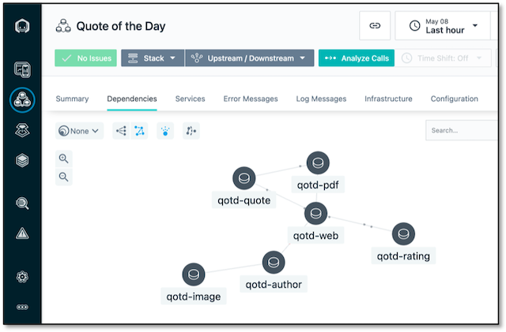
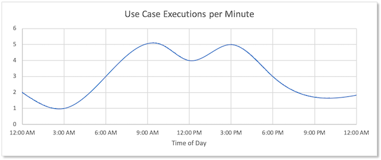

# Quote of the Day

The Quote of the Day (QotD) application is demonstration microservice application, specifically for use with IBM Watson AIOps.  It is optionally instrumented for Istana, and provides a wealth of logs and metrics (Prometheus compatible).

## What it does

The application itself is very simple.  Navigate to the home page and you will be greeted with a quote from a famous (our nearly famous) person that has been selected for the current day of the year.  The quotes come from a database of over 500 quotes, and have been categorized by genre. Each quote is rated (with a banner of stars). The user can then optionaly request a new random quote, or request the quote in PDF form.  Finally the user can click on the authors link to get a short biography and picture (graciously obtained from wikipedia).

Some of the authors bio's and pictures don't exist and these will result in errors added to the log.  This is expected, and part of the overall function of the app.

In addition to the application itself there is a load generator and anomaly generator (both metadata driven), that is expected to be deployed with the application.  The load and anomaly generator can be deployed to the same namespace as the app (simpler), or can be deployed to another namespace.  If deployed to another namespace, ensure the network policies are such that the `qotd` project pods can accept connections from other namespaces.

## Installation

This application does not have a helm chart (yet), nor has an operator been written for kubernetes deployments.  Therefore you will need to manually deploy the components directly from yaml files.

[Deploy to OpenShift 4.x](ocp4_deployment.md)

## Service Architecture

The QotD application is spread out over 6 services and one database, as shown in the figure below.  The "ratings db" is conceptual, the actual implementation for the ratings service is just a random number generator - in some ways truer to life.   

The arrows in the diagram indicate a dependency, or more specifically they represent a call from the one component to another.  All calls in the outward function of this application are HTTP REST (GET) calls.

Each service generates its own logs and provides metrics which are modified to simulate anomalous behaviors.

Services are instrumented for Instana.  This enables it to construct a topology of the services.

## Components

### Web 

The [web](https://gitlab.com/quote-of-the-day/qotd-web) component is the web front end of the application and the starting point for all scenarios in the application.  It is implemented as a Node.js Express application, and like all the service components has additional APIs that are called by the anomaly generator, which can introduce new log messages, modify the CPU and memory metrics as well as modify the built in time delay of every API (and web) call.

### Quote 

The [quote](https://gitlab.com/quote-of-the-day/quote-service) service provides the quotes to the web tier.  It queries a MariaDB database with over 500 quotes in it.  The quote database includes only the quote, author name and genre.  It does not include author bio information.  This is provided by the author service.

### Rating

The [rating]() service provides a rating.  The rating is actually randomly generated, but conceptually the information might come from another database.  The rating is 0 to 5 stars, with half stars allowed, which effectively permits an integer value of 0 to 10 (inclusive).

### Author

The [author]() service provides biographical information of an author.  A link around the author's name driects the browser to the author's page.  The web front end calls the author service to get the author's biographical information (as found on Wikipedia), and also calls it for the author's image.  The author service then calls the image service to get an actual image (if available).  

### Image

The [image]() service provide JPG images of authors. Not all authors have an image available, in which case a placeholder is returned.

### PDF

The [pdf]() service generates a new PDF resource with the quote and author name in it.  The PDF is generated on the fly with the help of the [`pdf-lib` module](https://www.npmjs.com/package/pdf-lib). 

## Load Scenarios

The [load generator](https://gitlab.com/quote-of-the-day/qotd-load-generator) for this application has 6 configurable use cases (scenarios).  Each use case is metadata defined, so that it is possible to easily create additional scenarios, both for load and anomaly generation (however the features to do this at runtime are not yet built, and any permanent changes to the scenarios require a rebuild of the app).

- [Daily Quote](uc_daily.md) [11]
- [Random Quote](uc_random.md) [23]
- [Author Daily](uc_author_daily.md) [21]
- [Author Random](uc_author_random.md) [35]
- [PDF Daily](uc_pdf_daily.md) [21]
- [PDF Random](uc_pdf_random.md) [34]

In all of the scenarios there is an optional delay after executing each step.  This delay is either exactly specified or nominally specified, in which case the delay time is generated from a normal distribution with a given mean and standard deviation (and optional upper and lower limits). 

The load varys according to the time of day. Each round of use case executions (one run of each of the above use cases) results in the generation of 145 log entries.  This means the variation of the number of log ,essages goes from 145 per minute to about 725 a minute.  Other messages are (i.e. from Instana agent) are also sent to the log aggregator, so the total number of log messages at any given time will be slightly higher.

## Anomaly Scenarios

More involved scenarios can be defined and run against the application, with the ability to manipulate the metrics, response time and introduce new log entries.  The following scenarios have been pre-defined.  Future releases of this application (assuming anyone uses it), will make it much easier to define your own scenarios and add it to the Use Case generator application.

This application makes heavy use of a normal distribtion [number generator](https://en.wikipedia.org/wiki/Box%E2%80%93Muller_transform).  It is used to vary the delays between execution of use case steps, as well as in the api response time of all the app's components as well as the load generator.

- [Ratings Service Failure](uc_rating_failure.md)

