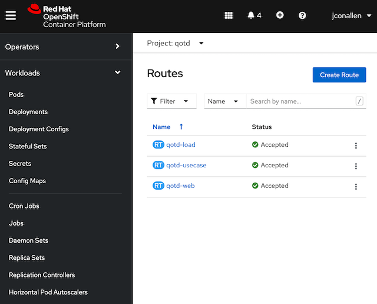
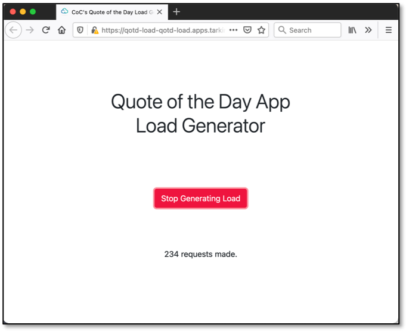

# Openshift 4.x Deployment

These instructions are by no means the only way QotD can be deployed.  Feel free to distribute components across platforms (i.e. OCP, VMs, etc.).  This will mean you will have to make changes to the environment variables (and ConfigMaps).  Details of such deployments are, for the time, out of scope of this initial set of documentation.

## Quick Start

1. After logging into OCP with cluster admin role, create a project (namespaces) for the application called `qotd`. Feel free to use another namespace, however you will have to edit all the provided yaml files.

```shell
oc new-project qotd
```

2. Unfortunately the current version of the database component (based on [MariaDB base image](https://hub.docker.com/_/mariadb/)) runs as root in the container.  So for now, you will have to give this container privledges to run in the `qotd` namespace.

```shell
oc project qotd
oc adm policy add-scc-to-user anyuid -z default
```

3. The kubernetes yaml files are in the `k8s` directory of this repository. Before you can apply them, you must edit the database password environment variable in the `qotd_db.yaml`, `qotd_author.yaml` and `qotd_quote.yaml` files.


4. Run the `oc create -f` command on all the files in the `k8s` directory of this repository.  If you have cloned this repository, you can just run the following command from the top of the project.

```shell
oc create -f k8s/
```

You should see a confirmation of the creation of the new resources.
```shell
deployment.apps/qotd-author created
configmap/qotd-author-factory-settings created
service/qotd-author created
route.route.openshift.io/qotd-author created
route.route.openshift.io/qotd-author-svc created
deployment.apps/qotd-db created
service/qotd-db created
deployment.apps/qotd-image created
configmap/qotd-image-factory-settings created
service/qotd-image created
service/qotd-image-svc created
route.route.openshift.io/qotd-image created
route.route.openshift.io/qotd-image-svc created
deployment.apps/qotd-pdf created
configmap/qotd-pdf-factory-settings created
service/qotd-pdf created
service/qotd-pdf-svc created
route.route.openshift.io/qotd-pdf created
route.route.openshift.io/qotd-pdf-svc created
deployment.apps/qotd-quote created
configmap/qotd-quote-factory-settings created
service/qotd-quote created
service/qotd-quote-svc created
route.route.openshift.io/qotd-quote created
route.route.openshift.io/qotd-quote-svc created
deployment.apps/qotd-ratings created
configmap/qotd-ratings-factory-settings created
service/qotd-rating created
service/qotd-rating-svc created
route.route.openshift.io/qotd-rating created
route.route.openshift.io/qotd-rating-svc created
deployment.apps/qotd-web created
configmap/qotd-web-factory-settings created
service/qotd-web created
service/qotd-web-svc created
route.route.openshift.io/qotd-web created
route.route.openshift.io/qotd-web-svc created
deployment.apps/qotd-load created
service/qotd-load created
route.route.openshift.io/qotd-load created
deployment.apps/qotd-usecase created
service/qotd-usecase created
route.route.openshift.io/qotd-usecase created
```

5. Give the system a chance to start up.  You should see three routes defined; the main web front end of the application, and two auxiliary applications, one for the load generator, and the other for a use case (anomaly) generator.



6. Verify the app is working.  Navigate to the app's home page; route `qotd-web`.


7. By default the load generator is not started.  Navigate to the `qotd-load` route.  Then press the Start button.  You will see the number of rounds of load use cases being updated every two seconds.



8. You can iniated an anomaly with the Anomaly generator app (separate from load generation).  Open it up with the `qotd-usecase` route.  Press the **Start Rating Service Failure** button to initiated an anomaly (see [Ratings Service Failure](uc_rating_failure.md)).

