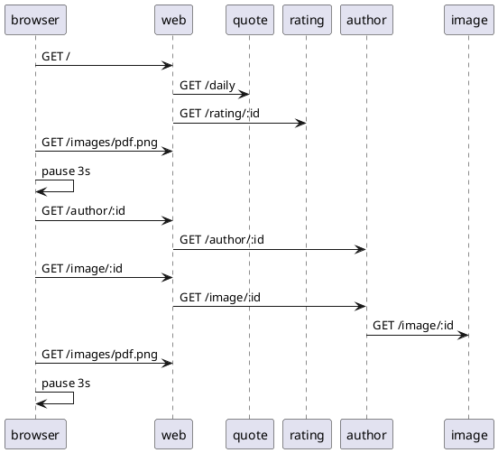

# Load Use Case: Author Daily

This use case is also an extension of the daily use case.  After navigating to the home page, and waiting for 3 seconds (nominally), the browser navigates the author's link.  This will request the author's biography info page.  21 log messages are generated each time this use case is executed.



## Logs

When this senario is executed the following logs can be expected in each component.  The first entry indicates a new indepenent web action was started.  The IP address of the requestor is recorded and a new token is generated. This token can be used to manually connect requests between components.

web
```
Starting new request token: 710739 for IP: 192.168.10.1
[710739] Web request: /.
[710739] Getting daily quote.
[710739] Obtained daily quote.
[710739] Getting rating for quote: 124
[710739] Got rating for quote: 124
Starting new request token: 276317 for IP: 192.168.10.1
[276317] Author bio request: /author/203 .
[276317] Author bio received.  Author id: 203
Starting new request token: 868221 for IP: 192.168.10.1
[868221] Author image request id: 203
[868221] Author image provided.
```

quote
```
[710739] Quote request: /daily.
[710739] Getting connection from pool
[710739] Daily quote sql returned rows: 1
```

rating
```
[710739] Ratings request, id: 124
[710739] The monkey's dart hit the 7
```

author
```
[276317] Author request, id: 203
[276317] Author summary supplied for id: 203
[868221] Author image request id: 203
[868221] Author image provided.
```

image
```
[868221] Image request id: 203
[868221] Image supplied id: 203
```

## Source

```json
{
    "id": "author_daily",
    "name": "Daily Author Bio",
    "description": "This use case navigates to the QotD home page, then clicks on the link to view the biography about the author.",
    "type": "normal",
    "steps": [
        {
            "name": "Navigate to home page",
            "type": "url",
            "service": "web",
            "nominal_delay": 3000
        },
        {
            "name": "Navigate to author bio",
            "type": "url_from_anchor",
            "anchor": "author_link",
            "nominal_delay": 3000
        }
    ]
}
```