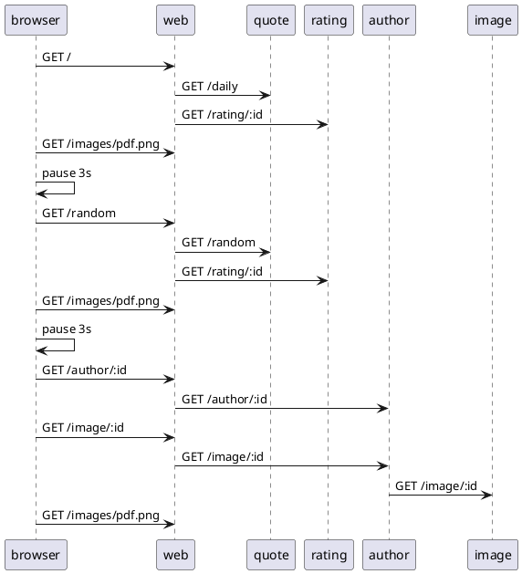

# Load Use Case: Random Author

In this scenario the user browses to a random quote after getting the daily quote.  Then selects the author bio link for the author of the random quote.  35 log messages are generated each time this use case is executed.




## Logs

When this senario is executed the following logs can be expected in each component.  The first entry indicates a new indepenent web action was started.  The IP address of the requestor is recorded and a new token is generated. This token can be used to manually connect requests between components.

web
```
Starting new request token: 688348 for IP: 192.168.10.1
[688348] Web request: /.
[688348] Getting daily quote.
[688348] Obtained daily quote.
[688348] Getting rating for quote: 124
[688348] Got rating for quote: 124
Starting new request token: 551840 for IP: 192.168.10.1
[551840] Web request: /random .
[551840] Getting random quote.
[551840] Obtained random quote.
[551840] Getting rating for quote: 28
[551840] Got rating for quote: 28
Starting new request token: 394762 for IP: 192.168.10.1
[394762] Author bio request: /author/270 .
[394762] Author bio received.  Author id: 270
Starting new request token: 223727 for IP: 192.168.10.1
[223727] Author image request id: 270
[223727] Author image provided.
```

quote
```
[688348] Quote request: /daily.
[688348] Getting connection from pool
[688348] Daily quote sql returned rows: 1
[551840] Quote request: /random.
[551840] Getting connection from pool
[551840] Random quote count quotes: SELECT COUNT(*) AS quote_count FROM quotes, count: 500
[551840] Got random quote from Lady Gaga
```

rating
```
[688348] Ratings request, id: 124
[688348] The monkey's dart hit the 7
[551840] Ratings request, id: 28
[551840] The monkey's dart hit the 7
```

author
```
[394762] Author request, id: 270
[394762] Author summary supplied for id: 270
[223727] Author image request id: 270
[223727] Author image provided.
```

image
```
[223727] Image request id: 270
[223727] Image supplied id: 270
```

## Source

```json
{
    "id": "author_random",
    "name": "Random Author Bio",
    "description": "This use case navigates to the QotD home page, then clicks on the link to view a Random quote.  Then follows the link to the biography about the author.",
    "type": "normal",
    "steps": [
        {
            "name": "Navigate to home page",
            "type": "url",
            "service": "web",
            "nominal_delay": 3000
        },
        {
            "name": "Navigate to Random quote",
            "type": "url_from_anchor",
            "anchor": "random_link",
            "nominal_delay": 3000
        },
        {
            "name": "View Author bio",
            "type": "url_from_anchor",
            "anchor": "author_link",
            "nominal_delay": 3000
        }

    ]
}
```
