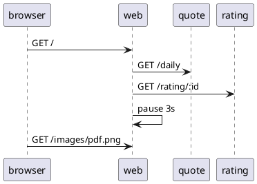

# Load Use Case: Daily

This is the simplest scenario. The browser navigates to the home page, then pauses for approximately 3 seconds.  11 log messages are generated each time this use case is executed.



## Logs

When this senario is executed the following logs can be expected in each component.  The first entry indicates a new indepenent web action was started.  The IP address of the requestor is recorded and a new token is generated. This token can be used to manually connect requests between components.

web
```
Starting new request token: 641069 for IP: 192.168.10.1
[641069] Web request: /.
[641069] Getting daily quote.
[641069] Obtained daily quote.
[641069] Getting rating for quote: 124
[641069] Got rating for quote: 124
```

quote
```
[641069] Quote request: /daily.
[641069] Getting connection from pool
[641069] Daily quote sql returned rows: 1
```

rating
```
[641069] Ratings request, id: 124
[641069] The monkey's dart hit the 8
```

## Source

```json
{
    "id": "daily",
    "name": "Daily Quote",
    "description": "This use case simply navigates to the QotD home page.",
    "type": "normal",
    "steps": [
        {
            "name": "Navigate to home page",
            "type": "url",
            "service": "web",
            "nominal_delay": 3000
        }
    ]
}
```