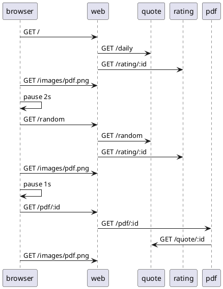

# Load Use Case: PDF of Daily Quote

This use case is a simple extension of the daily use case.  After navigating to the home page, and waiting for 2 seconds (nominally), the browser navigates the PDF link.  This will request a newly generated PDF from the PDF component. The PDF component directly accesses the quote component to get the text of the quote, and the author name.  34 log messages are generated each time this use case is executed.



## Logs

When this senario is executed the following logs can be expected in each component.  The first entry indicates a new indepenent web action was started.  The IP address of the requestor is recorded and a new token is generated. This token can be used to manually connect requests between components.

web
```
Starting new request token: 209045 for IP: 192.168.10.1
[209045] Web request: /.
[209045] Getting daily quote.
[209045] Obtained daily quote.
[209045] Getting rating for quote: 124
[209045] Got rating for quote: 124
Starting new request token: 352488 for IP: 192.168.10.1
[352488] Web request: /random .
[352488] Getting random quote.
[352488] Obtained random quote.
[352488] Getting rating for quote: 432
[352488] Got rating for quote: 432
[334013] PDF request for quote id: 432
[334013] PDF received.
[334013] PDF image sent.
```

quote
```
[209045] Quote request: /daily.
[209045] Getting connection from pool
[209045] Daily quote sql returned rows: 1
[352488] Quote request: /random.
[352488] Getting connection from pool
[352488] Random quote count quotes: SELECT COUNT(*) AS quote_count FROM quotes, count: 500
[352488] Got random quote from Nelson Goodman
[334013] Quote request: /quotes/432.
[334013] Getting connection from pool
[334013] Select quotes sql query completed, rows: 1
```

rating
```
[209045] Ratings request, id: 124
[209045] The monkey's dart hit the 8
[352488] Ratings request, id: 432
[352488] The monkey's dart hit the 7
```

pdf
```
[334013] PDF request for quote id: 432
[334013] Getting quote information for id: 432
[334013] Obtained quote id: 432
[334013] Building PDF for Nelson Goodman quote.
[334013] Quote PDF provided for quote 432.
```

## Source

```json
{
    "id": "pdf_random",
    "name": "PDF from random quote",
    "description": "This use case navigates to the QotD home page, then clicks on the link to view a Random quote.  Then requests a pdf of the quote.",
    "type": "normal",
    "steps": [
        {
            "name": "Navigate to home page",
            "type": "url",
            "service": "web",
            "nominal_delay": 2000
        },
        {
            "name": "Navigate to Random quote",
            "type": "url_from_anchor",
            "anchor": "random_link",
            "nominal_delay": 1000
        },
        {
            "name": "Request PDF",
            "type": "url_from_anchor",
            "anchor": "pdf_link"
        }

    ]
}
```

