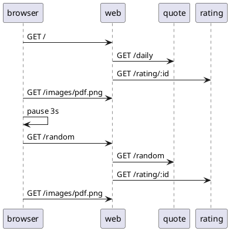

# Load Use Case: Random

This use case is a simple extension of the daily use case.  After navigating to the home page, and waiting for 3 seconds (nominally), the browser navigates the "Random" link.  This will request a new random quote to be displayed. 23 log messages are generated each time this use case is executed.



## Logs

When this senario is executed the following logs can be expected in each component.  The first entry indicates a new indepenent web action was started.  The IP address of the requestor is recorded and a new token is generated. This token can be used to manually connect requests between components.

web
```
Starting new request token: 641069 for IP: 192.168.10.1
[641069] Web request: /.
[641069] Getting daily quote.
[641069] Obtained daily quote.
[641069] Getting rating for quote: 124
[641069] Got rating for quote: 124
Starting new request token: 662725 for IP: 192.168.10.1
[662725] Web request: /random .
[662725] Getting random quote.
[662725] Obtained random quote.
[662725] Getting rating for quote: 4
[662725] Got rating for quote: 4
```

quote
```
[641069] Quote request: /daily.
[641069] Getting connection from pool
[641069] Daily quote sql returned rows: 1
[662725] Quote request: /random.
[662725] Getting connection from pool
[662725] Random quote count quotes: SELECT COUNT(*) AS quote_count FROM quotes, count: 500
[662725] Got random quote from Rick Warren
```

rating
```
[641069] Ratings request, id: 124
[641069] The monkey's dart hit the 8
[662725] Ratings request, id: 4
[662725] The monkey's dart hit the 7
```

## Source

```json
{
    "id": "random",
    "name": "Random Quote",
    "description": "This use case navigates to the QotD home page, then selects a random quote.",
    "type": "normal",
    "steps": [
        {
            "name": "Navigate to home page",
            "type": "url",
            "service": "web",
            "nominal_delay": 3000
        },
        {
            "name": "Navigate to Random quote",
            "type": "url_from_anchor",
            "anchor": "random_link",
            "nominal_delay": 3000
        }
    ]
}
```