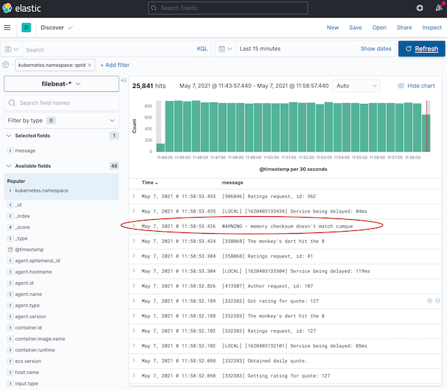
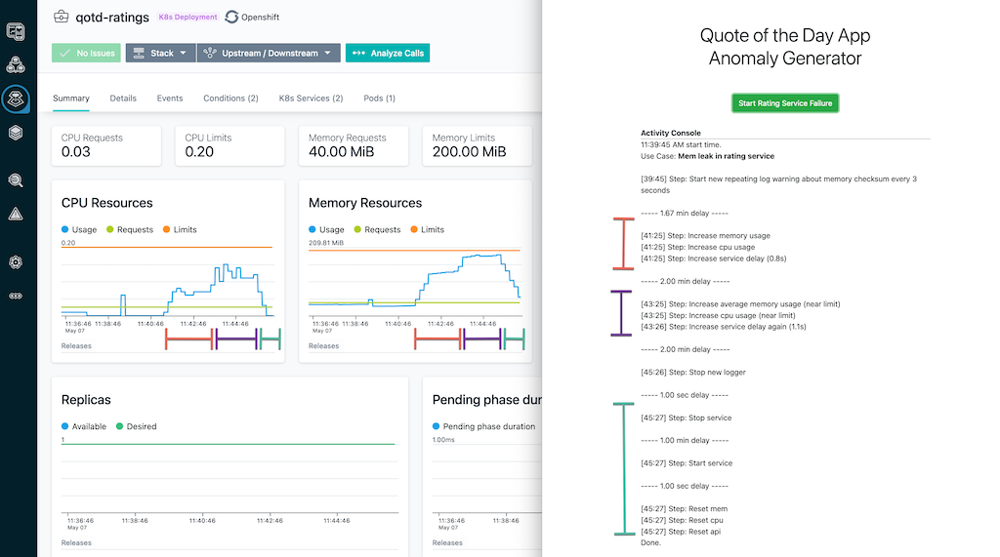

# Anomaly: Rating Service Failure

This use case executes the following steps:

1. A new type of log entry is created and generated by the ratings service.  This log entry repeast about every 3 seconds, with a randomly generated field (`{{WORD}}`).  The template for the log is:

```
WARNING - memory checksum doesn't match {{WORD}}
```
An example of such a log entry might be:

```
WARNING - memory checksum doesn't match lorum
```
After this step is initiated, the use case pauses for Then there is a pause for 2 minutes (120000 ms).

2. After the 2 minutes, the service experiences a CPU and memory usage increase.  The increases are significant and noticeable, but still well below the stated limits (as defined in the kubernetes Deployment definition). The average API response time is increased with a nominal 800ms delay. After these adjustments, the use case pauses for another 2 minutes.

3. When this use case resumes, the API response, CPU and memory usage are increased again.  The response time now has a nominal 1100ms delay, and the cpu and memory usage are nearing the limits.  The use case then pauses for another 2 minutes.

4. When the use case resumes, the new log entry generation is stopped, and the use case is paused for just one second.

5. The rating service is stopped.  No incoming or outgoing communication is allowed. The use case pauses for 2 minutes.

6. When the use case resumes, the system is reset.  The service is turned back on, api response, CPU and memory usage are all returned to thier default factory settings.

## Log Anomaly

The log anomaly appears in the log aggregator as:



## Instana View

The following screen shot show the Instana console (10 min window) of the ratings service, alongside the completed output of the anomaly generator.




## Source

```json
{
    "id": "mem_failure_ratings",
    "name": "Mem leak in rating service",
    "description": "This use case navigates to the QotD home page, then clicks on the link to view a Random quote.  Then follows the link to the biography about the author.",
    "type": "anomaly",
    "steps": [
        {
            "name": "Start new repeating log warning about memory checksum every 3 seconds",
            "type": "add_logger",
            "service": "rating",
            "log": {
                "id": "log1",
                "template": "WARNING - memory checksum doesn't match {{WORD}} ",
                "fields": {
                    "WORD": {
                        "type": "word"
                    }
                },
                "repeat": {
                    "mean": 3000,
                    "stdev": 100,
                    "min": 2000,
                    "max": 4000
                }
            },
            "delay": 120000
        },
        {
            "name": "Increase memory usage",
            "type": "metric",
            "service": "rating",
            "metric": "mem",
            "value": {
                "hogs": 10
            }
        },
        {
            "name": "Increase cpu usage",
            "type": "metric",
            "service": "rating",
            "metric": "cpu",
            "value": {
                "hogs": 20
            }
        },
        {
            "name": "Increase service delay (0.8s)",
            "type": "metric",
            "service": "rating",
            "metric": "apiRes",
            "value": {
                "mean": 800,
                "stdev": 200,
                "min": 200,
                "max": 1100
            },
            "ramp": 100000,
            "delay": 120000
        },
        {
            "name": "Increase average memory usage (near limit)",
            "type": "metric",
            "service": "rating",
            "metric": "mem",
            "value": {
                "hogs": 15
            }
        },
        {
            "name": "Increase cpu usage",
            "type": "metric",
            "service": "rating",
            "metric": "cpu",
            "value": {
                "hogs": 40
            }
        },
        {
            "name": "Increase service delay again (1.1s)",
            "type": "metric",
            "service": "rating",
            "metric": "apiRes",
            "value": {
                "mean": 1100, 
                "stdev": 200, 
                "min": 800, 
                "max": 1500
            },
            "ramp": 100000,
            "delay": 120000
        },
        {
            "name": "Stop new logger",
            "type": "remove_logger",
            "service": "rating",
            "logid": "log1",
            "delay": 1000
        },
        {
            "name": "Stop service",
            "type": "service_action",
            "service": "rating",
            "action": "stop",
            "delay": 60000
        },
        {
            "name": "Start service",
            "type": "service_action",
            "service": "rating",
            "action": "start",
            "delay": 1000
        },   
        {
            "name": "Reset mem",
            "type": "reset_metric",
            "metric": "mem",
            "service": "rating"
        },
        {
            "name": "Reset cpu",
            "type": "reset_metric",
            "metric": "cpu",
            "service": "rating"
        },
        {
            "name": "Reset api",
            "type": "reset_metric",
            "metric": "apiRes",
            "service": "rating"
        }
    ]
}
```