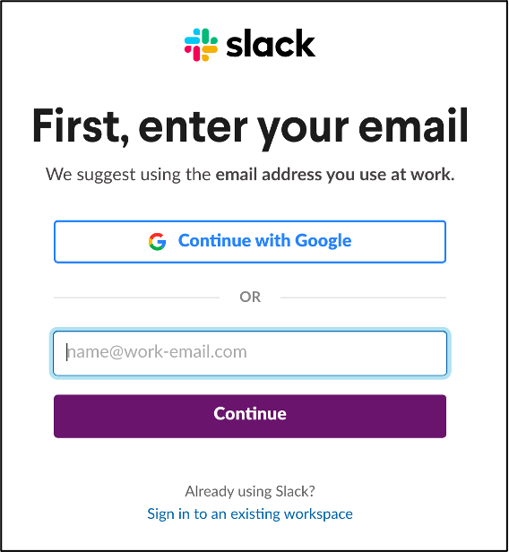
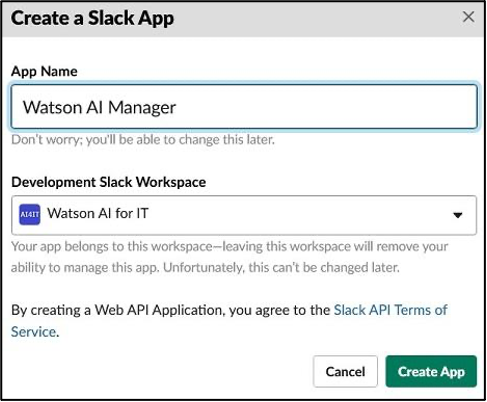

# Initial Slack Setup

For the system to work you need to setup your own secure gateway and slack workspace. It is suggested that you do this within the public slack so that you can invite the customer to the experience as well. It also makes it easier for is to release this image to Business partners

You will need to create your own workspace to connect to your instance of AI Manager.

## Create your Slack Workspace

Create a Slack workspace by going to https://slack.com/get-started#/createnew and logging in with an email <i>**which is not your IBM email**</i>. Your IBM email is part of the IBM Slack enterprise account and you will not be able to create an independent Slack workspace outside if the IBM slack service. 

After authentication, you will see the following screen:

Click **Create a Workspace** ->

Step 1 of 3 – Name your Slack workspace

  

Give your workspace a unique name such as aiops-\<yourname\>.

Step 2 of 3 – Describe the workspace current purpose

  

This is free text, you may simply write “demo for Watson AIOps” or whatever you like.

Step 3 of 3

  

You may add team members to your new Slack workspace or skip this step.

At this point you have created your own Slack workspace where you are the administrator and can perform all the necessary steps to integrate with Watson AIOps AI Manager.

**Note** : This Slack workspace is outside the control of IBM and must be treated as a completely public environment. Do not place any confidential material in this Slack workspace.

## Create Your Slack App

Create a Slack app, by going to https://api.slack.com/apps and clicking **Create New App**. In the pop-up dialog, enter an App Name and specify which Workspace it will be connected to and then click Create App.

   

On the OAuth & Permissions page, select **Scopes** and verify that the following **Bot Token Scopes** have been added: `app_mentions:read`, `channels:manage`, `groups:write`,  `chat:write`, `files:write`, `users:read`, `groups:read`, and `channels:read`.

   

The next step is to install the Slack app. On the OAuth & Permissions page, scroll to the top section called **OAuth Tokens & Redirect URLs**.

In the pop-up dialog, Select Install App to Workspace.

   

Click **Install App to Workspace**. In the pop-up dialog, review the information and click **Allow**.

   

The **Bot User OAuth Access Token** that will be needed to configure the Slack integration in AI Manager is now shown. Copy this token and save it.

   

On the Basic Information page, select **App Credentials** and note the <i>**Signing Secret**</i> value. Copy this secret and save it. It will also be needed to configure the Slack integration in AI Manager.  
   
