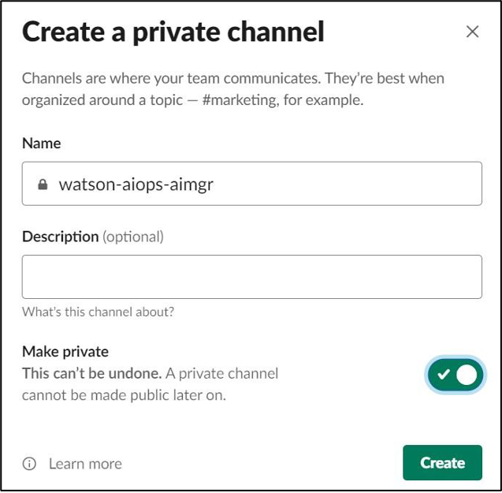
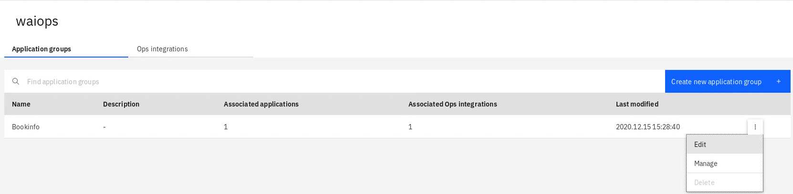
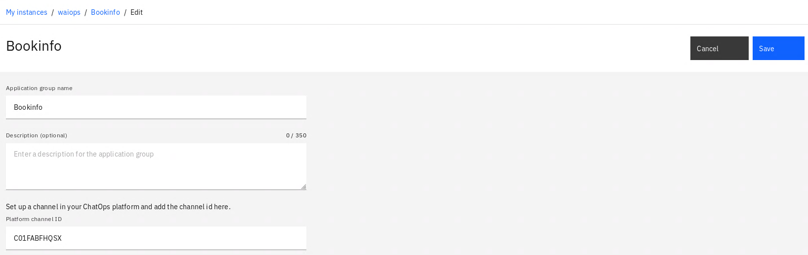
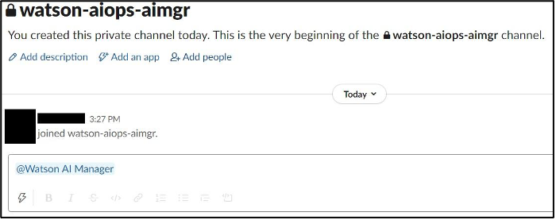
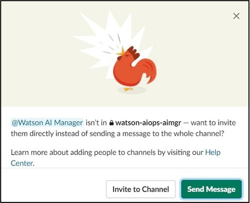

# Configuring the Slack Channel

You can use an existing Slack channel or create a new Slack channel. A sample channel is shown here named `#watson-aiops-aimgr` and is made private (invitation only).

Capture the channel ID by right-clicking on the channel name, the select **Copy Link** to get the web URL link. The last part of the link is the channel ID.

Example: `https://watsonaiforit.slack.com/archives/G017SA7NQ9L`

The channel ID for example above is `G017SA7NQ9L`. Save this ID to use for further configuration in AI Manager.

## Configuring an Application Group with a Slack Channel

Switch back to AI Manager, and Open **waiops.**  From **Bookinfo**, select edit.

Set the **Platform channel ID** to the value of your Slack channel ID saved earlier, and save.

<!--
Switch back to AI Manager in your browser. On the instance page, click **Create new application group**. Name the application group and set the **Platform channel ID** to the value of your Slack channel ID saved earlier.  

Click **Save application group**. Now all the applications added to this application group will target the Slack channel created earlier.

-->

## Invite the Slack app to the channel

At this point it is possible to add the Slack app to a channel and test basic communications. Open the Slack channel created previously and tag the application in a message.  

A dialog will display allowing an invitation to the Slack app.   

Click **Invite to Channel**. The Slack app will send a message to the channel.  

You can also show the welcome message any time by using the slash command configured for the Slack app.  

Congratulations, you have configured a Slack app for communication with AI Manager.
