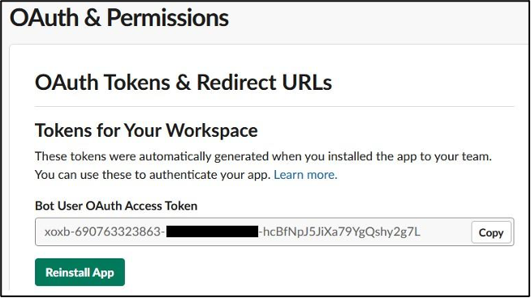
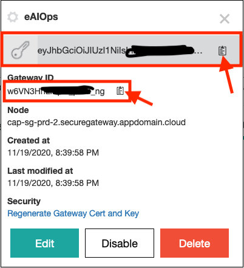
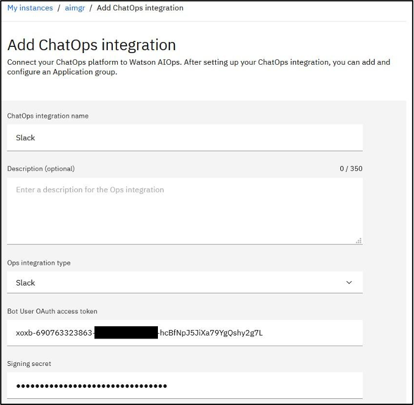
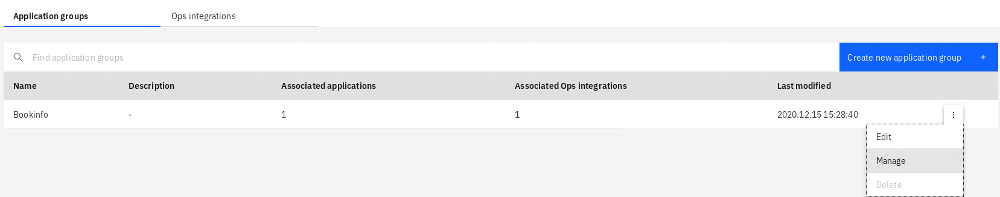
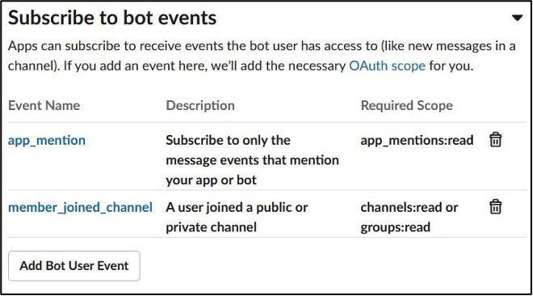
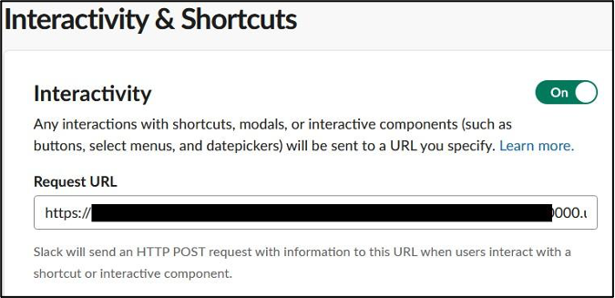

# Existing Slack Setup

Following this page, when you have an existing Slack configuration, and you have provisioned a new AIOPs Environment

## Capture Existing Slack Config
  Log in to the Slack workspace you created previously by going to https://api.slack.com/apps and collect the following Parameters **Bot User OAuth access Token** , **Signing secret** and **channel ID**, you will need to configure AI Manager with them later

  The **Bot User OAuth Access Token** is in the Oauth & Permissions tab.

  

  The **Signing Secret** in on the **Basic Information page**, select **App Credentials**

  

  Capture the channel ID by right-clicking on the channel name, the select **Copy Link** to get the web URL link. The last part of the link is the channel ID.

        Example: `https://watsonaiforit.slack.com/archives/G017SA7NQ9L`
## Install the Secure gateway
Log in to your [IBM Cloud](https://cloud.ibm.com) account, and retreive the `Gateway ID` and the `token`. For this, click on the gear icon in the created gateway and make a note of security token and the Gateway ID.

   

The Gateway Key : `***`

The Gateway ID : `FRhpJKUgSvU_prod_au-syd`

|Location|Secure gateway Address|
|--|--|
|US South| sgmanager.us-south.securegateway.cloud.ibm.com|
| US East| sgmanager.us-east.securegateway.cloud.ibm.com|
| United Kingdom| sgmanager.eu-gb.securegateway.cloud.ibm.com|
| Germany| sgmanager.eu-de.securegateway.cloud.ibm.com|
| Sydney| sgmanager.au-syd.securegateway.cloud.ibm.com|

On the Watson AIOps DNS node perform the following:

1.  run the following commands

     ```bash
     oc project zeno
     oc delete secret ibm-secure-gateway
     oc create secret generic ibm-secure-gateway --from-literal='GATEWAY_TOKEN=<gateway_key>' --from-literal='GATEWAY_ID=<id>'
     ```

4.	Un-install and re-install the secure gateway
    ```bash
    cd /root/aiops/slack
    helm uninstall aiops-dev-test
    rm /root/aiops/slack/dev/ibm-watson-aiops-dev-install/templates/job.yaml
    ```

    You might have to wait 2-3 mins for all the resources to be removed

    ```bash
    helm upgrade -i aiops-dev-test ./dev/ibm-watson-aiops-dev-install --set strimzi.enabled=false --set s3fs.enabled=false --set secureGateway.hostName=<your_Secure_Gateway_address>
    ```

This will create you a both a destination and a client in your secure gateway as follows:


## Update AI Manager
  Log into AI Manager and edit Ops integration tab, replace the token and secret from above and click Save

  

  The channel ID for example above is `G017SA7NQ9L`. Save this ID to use for further configuration in AI Manager.

## Configuring an Application Group with a Slack Channel

  Switch back to AI Manager in your browser. On the instance page, click **Create new application group**. Name the application group and set the **Platform channel ID** to the value of your Slack channel ID saved earlier.  
  

  Click **Save application group**. Now all the applications added to this application group will target the Slack channel created earlier.

## Configure Slack App Communications

  Return to the browser tab for the Slack app. Under **Features**, select **Event Subscriptions**. In the **Enable Events** section, click the slider to enable events. For the Request URL field use the **Request URL** value obtained from AI Manager above.

  

  e.g: `https://cap-au-sg-prd-05.securegateway.appdomain.cloud:15182/aiops/ibm-aiops---waiops/instances/1600665218115943/api/slack/events`

  After pasting the value in the field, a *Verified* message should display.

  

  On the **Subscribe to bot events** section, add `app_mention` and `member_joined_channel` events.

  

  Click **Save Changes** button.

  Under **Features**, select **Interactivity & Shortcuts**. In the Interactivity section, click the slider to enable interactivity. For the **Request URL** field, use use the node and port where your secure gateway is running.
  e.g: `https://cap-au-sg-prd-05.securegateway.appdomain.cloud:15182/aiops/ibm-aiops---waiops/instances/1600665218115943/api/slack/events`

  . **There is no automatic verification for this form**.

  

  Click **Save Changes** button.

  Now, configure the **welcome** slash command. With this command, you can trigger the welcome message again if you closed it. Under Features, click **Slash Commands**, then click **Create New Command** to create a new slash command. Use the following values:

e.g: `https://cap-au-sg-prd-05.securegateway.appdomain.cloud:15182/aiops/ibm-aiops---waiops/instances/1600665218115943/api/slack/events`

  |Field|Value|
  |-|-|
  |Command| /waiops-welcome|
  |Request URL|the URL value obtained from AI Manager above|
  |Short Description| Welcome to Watson AIOps|


## test the Slack Config

  You should now be able  show the welcome message by using the slash command /waiops-welcome   
  

  Congratulations, you have configured a Slack app for communication with AI Manager.  

## Debugging
  1) Check there is traffic on the secure gateway, If there is none, then this will point to a problem with you Slack Environment

  2) If there is incoming traffic but no response then delete the following two pods, and try again.

  ibm-aiops---waiops-aio-chatops-orchestrator-dd7df5d55-d8ckd     
  ibm-aiops---waiops-aio-chatops-slack-integrator-848cbd744-k9zv9
