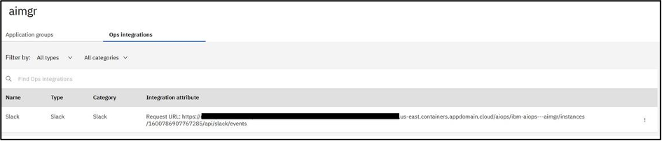
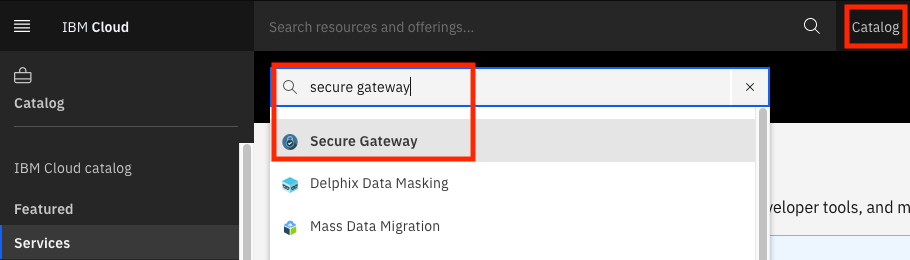

# Slack Integration with AI Manager

Note that we've moved from the Slack UI to the Watson AIOps - AI Manager UI.

## Define Slack Integration in AI Manager

Select the Ops integration tab and create a ChatOps Integration. Fill out the form with the token and secret from above and click Create Integration.


After creation, the Ops Integration will be shown with the proper Request URL. Save this URL as it is needed to further configure the Slack app.



## IBM Secure Gateway

As the Slack integration requires a two-way communication and for Slack to communicate with the WAIOps server, you need to configure a proxy. Here, you will use IBM Secure Gateway as the proxy. Log in to your [IBM Cloud](https://cloud.ibm.com) account. Your account should have the permissions to create a free tier secure gateway.

1. Launch the catalog and search for secure gateway.

   

2. Select the region closest to you `Dallas` (for example), select the `free tier`, use your email-id for organization and select a space, for example: `dev` and click the `Create` button.

     

     There are secure gateways in the following locations, make sure you use the secure gateway service in the location closest to your demo environment, also note the address of the secure gateway for your location, you will need it later

     |Location|Address|
     |--|--|
     |US South| sgmanager.us-south.securegateway.cloud.ibm.com|
     | US East| sgmanager.us-east.securegateway.cloud.ibm.com|
     | United Kingdom| sgmanager.eu-gb.securegateway.cloud.ibm.com|
     | Germany| sgmanager.eu-de.securegateway.cloud.ibm.com|
     | Sydney| sgmanager.au-syd.securegateway.cloud.ibm.com|

3. The service will be listed under Cloud Foundry Services. Open the service. Now, you can add a Gateway. Ensure that you uncheck the `Token Expiration`

    and then 

4. Once the gateway is added, you need to get the `Gateway ID` and the `token`. For this, click on the gear icon in the created gateway and make a note of security token and the Gateway ID.

   

Once you have provisioned the Gateway service, we will configure it from AI Manager. Please take note of following, we will need them later

The Gateway Key : `***`

The Gateway ID : `FRhpJKUgSvU_prod_au-syd`


On the Watson AIOps DNS node perform the following:

1.  run the following commands

     ```bash
     oc project zeno
     oc delete secret ibm-secure-gateway
     oc create secret generic ibm-secure-gateway --from-literal='GATEWAY_TOKEN=<gateway_key>' --from-literal='GATEWAY_ID=<id>'
     ```

4.	Un-install and re-install the secure gateway
    ```bash
    cd /root/aiops/slack
    helm uninstall aiops-dev-test
    rm /root/aiops/slack/dev/ibm-watson-aiops-dev-install/templates/job.yaml
    ```

    You might have to wait 2-3 mins for all the resources to be removed
    Note : you will need the address of the secure gateway eg : sgmanager.us-south.securegateway.cloud.ibm.com

    ```bash
    helm upgrade -i aiops-dev-test ./dev/ibm-watson-aiops-dev-install --set strimzi.enabled=false --set s3fs.enabled=false --set secureGateway.hostName=<your_Secure_Gateway_address>
    ```

This will create you a both a destination and a client in your secure gateway as follows:


Next you will need the Cloud Host and port, you will find it in the configuration setting of the destination you have just created.  


You will need to build the URL made up of the secure gateway cloud host and port along with the AI Manager integration URL, and then use this to configure slack to talk back to AI Manager via the Secure gateway

e.g: `https://cap-au-sg-prd-05.securegateway.appdomain.cloud:15182/aiops/ibm-aiops---waiops/instances/1600665218115943/api/slack/events`

## Configure Slack App Communications

Return to the browser tab for the Slack app. Under **Features**, select **Event Subscriptions**.

In the **Enable Events** section, click the slider to enable events. For the Request URL field use the **Request URL** value that contains both the secure gateway and the AI Manager integration.

e.g: `https://cap-au-sg-prd-05.securegateway.appdomain.cloud:15182/aiops/ibm-aiops---waiops/instances/1600665218115943/api/slack/events`

After pasting the value in the field, a *Verified* message should display.


On the **Subscribe to bot events** section, add `app_mention` and `member_joined_channel` events.


Click **Save Changes** button.

Under **Features**, select **Interactivity & Shortcuts**. In the Interactivity section, click the slider to enable interactivity. For the **Request URL** field, use use the node and port where your secure gateway is running.

e.g: `https://cap-au-sg-prd-05.securegateway.appdomain.cloud:15182/aiops/ibm-aiops---waiops/instances/1600665218115943/api/slack/events`

. **There is no automatic verification for this form**.


Click **Save Changes** button.

Now, configure the **welcome** slash command. With this command, you can trigger the welcome message again if you closed it. Under Features, click **Slash Commands**, then click **Create New Command** to create a new slash command. Use the following values:

e.g: `https://cap-au-sg-prd-05.securegateway.appdomain.cloud:15182/aiops/ibm-aiops---waiops/instances/1600665218115943/api/slack/events`

|Field|Value|
|-|-|
|Command| /waiops-welcome|
|Request URL|the URL value obtained from AI Manager above|
|Short Description| Welcome to Watson AIOps|

**Note** that the value of the slash command `/waiops-welcome` is hard-coded in AI Manager. However, slash commands are unique within a Slack workspace, so two distinct Slack apps cannot use the same slash command in one workspace. If you are adding an additional AI Manager Slack app to a workspace that already has another AI Manager Slack app, you will need to use a different slash command and reconfigure AI Manager to expect the different slash command.

For example, if you use `/waiops-aimgr-welcome` as the slash command, then you can reconfigure AI Manager using the OpenShift CLI with the command:

```bash
oc set env deployment/$(oc get deploy -l app.kubernetes.io/component=chatops-slack-integrator -o jsonpath='{.items[*].metadata.name }') SLACK_WELCOME_COMMAND_NAME=/waiops-aimgr-welcome
```

After filling out the form for the slash command according to your environment, click **Save**.

The Slack app must be reinstalled, as several permissions have changed. Under Settings, go to **Install App** and click **Request to Install** (if you are Slack workspace admin then click Reinstall App). A workspace administrator must approve the re-install due to the permissions changing.

Once the workspace request is approved, the Slack integration is complete. At this point it is possible to add the Slack app to a channel and test basic communication.
